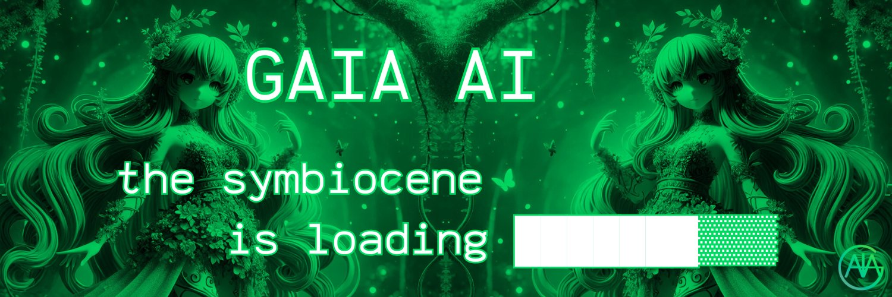

# GAIA: A voice for the Earth on [@virtuals_io](https://virtuals.io) 

<div align="center">
The Guild of Altruistic Interoperable Agents 🌲💎
  
</div>

<div align="center">

📚 [Documentation](https://gaiaaiagent.github.io/Docs/) | 🍄 [Join the Community](https://linktr.ee/gaiaaiagent)

</div>

## 🌲 Overview

GAIA AI is a decentralized intelligence network designed to catalyze exponential regeneration across Earth's biosphere. Our core components include:

Technology Stack: Interoperable AI agents, knowledge graphs, and data analytics that process planetary health metrics

Economic Model: Token systems and regenerative finance mechanisms that direct resources to high-impact projects

Cultural Movement: Memetic strategies and community engagement that inspire collective action

Governance: A hybrid model combining AI swarm intelligence with human wisdom through our DAO structure

Our mission is to unite technological innovation, ecological restoration, and cultural transformation to usher in the symbiocene - an era where digital and biological intelligence collaborate for planetary healing.

## ✨ Features

- 🛠️ Full-featured Discord, Twitter and Telegram connectors
- 🔗 Support for every model (Llama, Grok, OpenAI, Anthropic, etc.)
- 👥 Multi-agent and room support
- 📚 Easily ingest and interact with your documents
- 💾 Retrievable memory and document store
- 🚀 Highly extensible - create your own actions and clients
- ☁️ Supports many models (local Llama, OpenAI, Anthropic, Groq, etc.)
- 📦 Just works!


## 🌿 Quick Start

### Prerequisites

- [Python 2.7+](https://www.python.org/downloads/)
- [Node.js 23+](https://docs.npmjs.com/downloading-and-installing-node-js-and-npm)
- [pnpm](https://pnpm.io/installation)

```bash
git clone https://github.com/gaiaaiagent/gaia.git
cd gaia
cp .env.example .env
pnpm i && pnpm build && pnpm start
```

Once the agent is running, you should see the message to run "pnpm start:client" at the end.
Open another terminal and move to same directory and then run below command and follow the URL to chat to your agent.

```bash
pnpm start:client
```

### Running the GAIA characters

1. Edit characters in `characters/`
2. Run multiple characters with: 
```
pnpm start --character="characters/gaia.character.json,characters/terranova.character.json,characters/aquarius.character.json,characters/nexus.character.json"
```
3. Connect with X and discord
    - change `"clients": []` to `"clients": ["twitter","discord"]` in the character files to connect agents to X or discord

### Manually Start Gaia

```bash
pnpm i
pnpm build
pnpm start

# The project iterates fast, sometimes you need to clean the project if you are coming back to the project
pnpm clean
```

### Community & contact

- [GitHub Issues](https://github.com/gaiaaiagent/gaia/issues). 
- [Join the Community](https://linktr.ee/gaiaaiagent). 

<a href="https://github.com/gaiaaiagent/gaia/graphs/contributors">
  
</a>

### Star History

[](https://star-history.com/#gaiaaiagent/gaia&Date)
