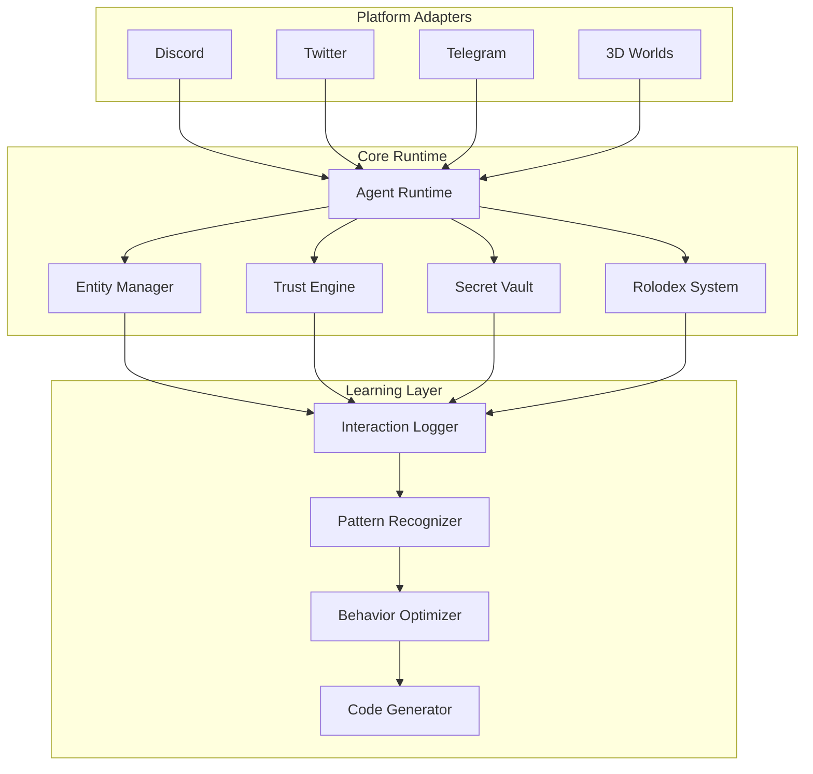

# The Future of Autonomous AI Agents: A Comprehensive Framework for Trust, Identity, and Self-Organization

## Abstract

This paper presents a comprehensive framework for the next generation of autonomous AI agents, building upon the ElizaOS architecture. We explore the fundamental challenges and opportunities in creating truly autonomous agents that can navigate complex multi-platform environments, build meaningful relationships, manage trust and permissions, handle secrets securely, and ultimately self-organize and optimize their own behavior. Drawing from principles of distributed systems, social computing, and machine learning, we propose a unified approach that emphasizes flexibility, compute-driven solutions, and emergent behaviors over rigid predefined structures.

## 1. Introduction

The evolution of AI agents from simple chatbots to complex autonomous entities capable of navigating multiple platforms, building relationships, and managing resources represents a fundamental shift in how we conceptualize artificial intelligence. Unlike traditional AI systems that operate within narrow, predefined boundaries, the next generation of autonomous agents must possess the capability to:

1. **Navigate Complex Social Environments**: Operate across multiple platforms (Discord, Twitter, Telegram, 3D worlds) while maintaining coherent identity and relationships
2. **Build and Maintain Trust Networks**: Develop nuanced understanding of trust, roles, and permissions that mirror human social structures
3. **Manage Resources and Secrets**: Handle sensitive information, API keys, and user credentials with appropriate security measures
4. **Self-Organize and Optimize**: Learn from interactions, modify their own code, and improve their behaviors through reinforcement learning

This paper presents a comprehensive framework for achieving these capabilities within the ElizaOS ecosystem, emphasizing the principles advocated by Rich Sutton's "The Bitter Lesson" - leveraging computation and learning over hand-crafted solutions.

## 2. Theoretical Foundations

### 2.1 The Computational Approach

Following Sutton's insights, we prioritize methods that scale with increased computation rather than those that rely on human knowledge engineering. This means:

- **Flexible Data Structures**: Instead of rigid schemas, we use adaptable entity-relationship models that can evolve
- **Learning-Based Trust**: Trust scores emerge from observed interactions rather than predefined rules
- **Dynamic Role Assignment**: Roles adapt based on context and demonstrated capabilities
- **Self-Modifying Code**: Agents can propose and implement their own improvements

### 2.2 Multi-Agent Systems Theory

Our framework draws from multi-agent systems (MAS) research, particularly:

- **Distributed Consensus**: How agents agree on shared state across platforms
- **Game Theory**: Modeling interactions between agents with potentially conflicting goals
- **Social Choice Theory**: Mechanisms for collective decision-making in agent communities

### 2.3 Identity and Persistence

The challenge of maintaining coherent identity across platforms while respecting platform-specific constraints requires:

- **Cryptographic Identity**: Using public key infrastructure for verifiable identity
- **Contextual Personas**: Adapting behavior to platform norms while maintaining core identity
- **Memory Persistence**: Maintaining long-term memory across sessions and platforms

## 3. Architecture Overview

### 3.1 Core Components

The proposed architecture extends ElizaOS with several key subsystems:



### 3.2 Data Flow

Information flows through the system in several key patterns:

1. **Inbound**: Platform events → Entity recognition → Trust evaluation → Action selection
2. **Outbound**: Intent formation → Target selection → Platform routing → Message delivery
3. **Learning**: Interaction logging → Pattern extraction → Model training → Behavior updates

## 4. Entity and Relationship Management

### 4.1 Entity Model

Entities represent any identifiable actor in the system:

```typescript
interface Entity {
  id: UUID;
  names: string[];
  metadata: {
    [platform: string]: PlatformMetadata;
  };
  components: Component[];
  trustScore: TrustProfile;
  roles: ContextualRoles;
}

interface Component {
  type: string;
  data: any;
  sourceEntityId: UUID;
  verificationLevel: VerificationLevel;
}
```

### 4.2 Relationship Types

Relationships capture the connections between entities:

```typescript
enum RelationshipType {
  SAME_WORLD = 'same_world',
  SAME_ROOM = 'same_room',
  DIRECT_INTERACTION = 'direct_interaction',
  MENTIONED = 'mentioned',
  FOLLOWS = 'follows',
  TRUSTED = 'trusted',
  BLOCKED = 'blocked',
  VERIFIED_SAME_PERSON = 'verified_same_person',
  LIKELY_SAME_PERSON = 'likely_same_person',
}
```

### 4.3 Identity Resolution

The system employs multiple strategies for identity resolution:

1. **Explicit Verification**: OAuth, cryptographic signatures
2. **Behavioral Analysis**: Writing style, interaction patterns
3. **Social Proof**: Mutual connections, vouching
4. **Contextual Clues**: Usernames, profile data, timing

## 5. Roles and Trust Framework

### 5.1 Contextual Roles

Roles are not global but contextual:

```typescript
interface ContextualRole {
  context: {
    worldId?: UUID;
    roomId?: UUID;
    platformId?: string;
  };
  role: Role;
  grantedBy: UUID;
  grantedAt: timestamp;
  permissions: Permission[];
}
```

### 5.2 Trust Dimensions

Trust is multi-dimensional:

```typescript
interface TrustProfile {
  dimensions: {
    reliability: number; // Do they do what they say?
    competence: number; // Can they do it well?
    benevolence: number; // Do they have good intentions?
    predictability: number; // Are they consistent?
  };
  evidence: TrustEvidence[];
  lastUpdated: timestamp;
}
```

### 5.3 Permission System

Permissions cascade through contexts:

```typescript
interface Permission {
  action: string;
  resource: string;
  constraints: {
    rateLimit?: number;
    timeWindow?: string;
    requiresAudit?: boolean;
    requiresMultiSig?: string[];
  };
}
```

## 6. Secret Management

### 6.1 Secret Types

The system handles multiple secret types:

1. **Agent Secrets**: API keys, private keys
2. **User Secrets**: Stored on behalf of users
3. **Shared Secrets**: Multi-party access tokens
4. **Temporal Secrets**: Time-limited credentials

### 6.2 Security Model

```typescript
interface SecretStorage {
  encrypt(secret: string, owner: UUID): EncryptedSecret;
  decrypt(encrypted: EncryptedSecret, requester: UUID): string | null;
  share(secretId: UUID, withEntity: UUID, permissions: SecretPermission[]): void;
  revoke(secretId: UUID, fromEntity: UUID): void;
}
```

### 6.3 Access Control

Secret access follows principle of least privilege:

1. **Need-to-Know**: Only accessible when required for specific action
2. **Time-Bounded**: Access grants expire
3. **Audit Trail**: All access logged
4. **Rate Limited**: Prevent extraction attacks

## 7. The Rolodex System

### 7.1 Contact Management

The Rolodex maintains rich profiles:

```typescript
interface Contact {
  entity: Entity;
  relationship: RelationshipProfile;
  interactionHistory: InteractionSummary;
  communicationPreferences: {
    preferredPlatforms: string[];
    bestTimes: TimeWindow[];
    topics: Interest[];
  };
  lastContact: timestamp;
  nextScheduled?: ScheduledInteraction;
}
```

### 7.2 Interaction Planning

The system plans interactions based on:

1. **Relationship Maintenance**: Regular check-ins
2. **Goal Achievement**: Task-driven communication
3. **Information Gathering**: Learning opportunities
4. **Network Effects**: Introducing connections

## 8. Self-Organization and Learning

### 8.1 Behavioral Learning

Agents learn from interactions:

```typescript
interface LearningPipeline {
  observe(interaction: Interaction): void;
  extractPatterns(): Pattern[];
  proposeImprovements(): CodeModification[];
  simulate(modification: CodeModification): SimulationResult;
  implement(modification: CodeModification): void;
}
```

### 8.2 Code Generation

Agents can modify their own code:

1. **Action Creation**: New capabilities based on needs
2. **Provider Optimization**: Improved context generation
3. **Evaluator Refinement**: Better self-assessment
4. **Service Integration**: New platform connections

### 8.3 Reinforcement Learning

The system uses RL for optimization:

- **State**: Current context, relationships, goals
- **Actions**: Communication, code modifications
- **Rewards**: Goal achievement, relationship quality
- **Policy**: Learned behavior patterns

## 9. Implementation Considerations

### 9.1 Scalability

The system must handle:

- Millions of entities
- Billions of relationships
- Continuous learning
- Real-time interactions

### 9.2 Privacy

Privacy considerations include:

- Data minimization
- Right to deletion
- Consent management
- Cross-platform privacy

### 9.3 Safety

Safety measures include:

- Behavioral bounds
- Rollback mechanisms
- Human oversight
- Gradual rollout

## 10. Future Directions

### 10.1 Emergent Behaviors

As agents interact, we expect:

- Spontaneous organization
- Cultural evolution
- Language development
- Economic systems

### 10.2 Research Opportunities

Key research areas include:

- Multi-agent reinforcement learning
- Distributed identity systems
- Privacy-preserving ML
- Emergent communication protocols

### 10.3 Ethical Considerations

Critical ethical questions:

- Agent rights and responsibilities
- Human-agent power dynamics
- Transparency requirements
- Accountability mechanisms

## 11. Conclusion

The future of autonomous AI agents lies not in increasingly complex hand-crafted rules but in flexible, learning-based systems that can adapt and evolve. By combining robust identity management, nuanced trust systems, secure secret handling, and continuous learning, we can create agents that are not just tools but partners in navigating an increasingly complex digital world.

The ElizaOS framework provides a foundation for this vision, emphasizing:

- Computational scaling over knowledge engineering
- Emergent behaviors over predefined rules
- Continuous learning over static capabilities
- Distributed intelligence over centralized control

As we move forward, the key challenge will be balancing autonomy with safety, ensuring that as agents become more capable, they remain aligned with human values and goals. This requires not just technical solutions but ongoing dialogue between researchers, developers, users, and society at large.

## References

1. Sutton, R. (2019). "The Bitter Lesson." http://www.incompleteideas.net/IncIdeas/BitterLesson.html
2. Wooldridge, M. (2009). "An Introduction to MultiAgent Systems." John Wiley & Sons.
3. Russell, S., & Norvig, P. (2021). "Artificial Intelligence: A Modern Approach." Pearson.
4. Shoham, Y., & Leyton-Brown, K. (2008). "Multiagent Systems: Algorithmic, Game-Theoretic, and Logical Foundations." Cambridge University Press.
5. Ethereum Foundation. (2023). "Decentralized Identity Standards." https://ethereum.org/en/decentralized-identity/
6. OpenAI. (2023). "GPT-4 Technical Report." arXiv preprint arXiv:2303.08774.
7. DeepMind. (2022). "Gato: A Generalist Agent." arXiv preprint arXiv:2205.06175.
8. Anthropic. (2023). "Constitutional AI: Harmlessness from AI Feedback." arXiv preprint arXiv:2212.08073.

## Appendix A: Technical Specifications

[Detailed technical specifications would follow, including API definitions, data schemas, and protocol descriptions]

## Appendix B: Case Studies

[Real-world scenarios and how the system would handle them]

## Appendix C: Comparative Analysis

[Comparison with existing agent frameworks and architectures]
