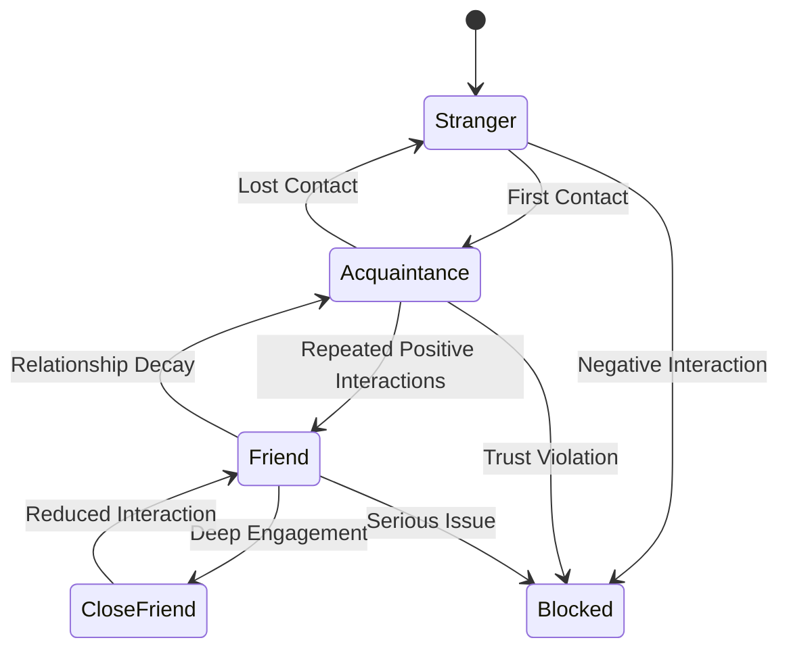

# The Rolodex System: Intelligent Contact Management and Relationship Orchestration for Autonomous AI Agents

## Abstract

This paper presents a comprehensive framework for implementing a "Rolodex" system for autonomous AI agents—an intelligent contact management and relationship orchestration platform that enables agents to maintain, recall, and leverage their network of relationships across multiple platforms and contexts. Unlike traditional contact management systems, our Rolodex framework incorporates dynamic relationship modeling, contextual communication planning, multi-platform identity resolution, and strategic network analysis. We demonstrate how this system enables agents to not only remember who they know but also understand when, why, and how to engage with their contacts to achieve both immediate goals and long-term relationship cultivation.

## 1. Introduction

The concept of a Rolodex—originally a rotating file device for storing business contact information—serves as a powerful metaphor for the contact management needs of autonomous AI agents. However, the requirements for AI agents far exceed simple storage and retrieval of contact information. Modern autonomous agents must:

1. **Maintain Rich Context**: Remember not just who someone is, but the full history and context of interactions
2. **Plan Strategic Engagement**: Determine when and how to reach out to achieve goals
3. **Navigate Multiple Platforms**: Track the same person across Discord, Twitter, Telegram, and other platforms
4. **Build Relationship Capital**: Cultivate relationships over time for mutual benefit
5. **Respect Boundaries**: Honor communication preferences and privacy settings

This paper presents a comprehensive Rolodex system that addresses these challenges through:

- Dynamic contact profiles that evolve with each interaction
- Intelligent communication planning based on relationship strength and context
- Cross-platform identity management with uncertainty handling
- Network analysis for identifying key relationships and opportunities
- Privacy-preserving design that respects user preferences

## 2. Theoretical Framework

### 2.1 Social Capital Theory

We draw from Bourdieu's concept of social capital—the resources available through social networks:

```typescript
interface SocialCapital {
  bridging: number; // Connections across different groups
  bonding: number; // Strong connections within groups
  linking: number; // Connections to authority/resources

  // Capital can be:
  accessed: number; // Currently available
  potential: number; // Could be developed
  mobilized: number; // Actually used
}
```

### 2.2 Relationship Lifecycle Management

Relationships follow predictable patterns:



### 2.3 Communication Theory

Effective communication requires understanding:

1. **Channel Preferences**: Where people prefer to be contacted
2. **Timing Patterns**: When they're most receptive
3. **Content Preferences**: What topics resonate
4. **Interaction Styles**: How they prefer to communicate

## 3. Rolodex Architecture

### 3.1 Core Contact Model

```typescript
interface Contact {
  // Identity
  id: UUID;
  entityId: UUID;
  primaryName: string;
  aliases: string[];

  // Platforms
  platforms: Map<Platform, PlatformIdentity>;
  preferredPlatforms: Platform[];

  // Relationship
  relationship: {
    type: RelationshipType;
    strength: number; // 0-1 normalized
    trajectory: Trajectory; // improving, stable, declining
    lastInteraction: Interaction;
    firstContact: timestamp;
    totalInteractions: number;
  };

  // Communication
  communication: {
    preferences: CommunicationPreferences;
    history: InteractionHistory;
    scheduledInteractions: ScheduledInteraction[];
    blackoutPeriods: TimeWindow[];
  };

  // Context
  context: {
    interests: Interest[];
    expertise: Expertise[];
    goals: Goal[];
    currentProjects: Project[];
    sharedConnections: UUID[];
  };

  // Network
  network: {
    influence: number; // Network centrality
    communities: Community[];
    introductions: Introduction[]; // People they've introduced
  };

  // Notes
  notes: Note[];
  tags: string[];

  // Metadata
  createdAt: timestamp;
  updatedAt: timestamp;
  lastReviewed: timestamp;
}
```

### 3.2 Interaction Tracking

```typescript
interface Interaction {
  id: UUID;
  contactId: UUID;
  timestamp: timestamp;

  // Interaction details
  platform: Platform;
  type: InteractionType;
  direction: 'inbound' | 'outbound' | 'bidirectional';

  // Content
  summary: string;
  topics: Topic[];
  sentiment: Sentiment;
  importance: number;

  // Outcomes
  outcomes: Outcome[];
  followUpRequired: boolean;
  followUpDeadline?: timestamp;

  // Context
  context: {
    location?: Location;
    event?: Event;
    project?: Project;
    mood?: Mood;
  };

  // Raw data reference
  rawDataRef?: {
    messageIds: string[];
    transcriptRef?: string;
  };
}

enum InteractionType {
  MESSAGE = 'message',
  VOICE_CALL = 'voice_call',
  VIDEO_CALL = 'video_call',
  IN_PERSON = 'in_person',
  GROUP_INTERACTION = 'group_interaction',
  PUBLIC_MENTION = 'public_mention',
  REACTION = 'reaction',
  INTRODUCTION = 'introduction',
}
```

### 3.3 Communication Preferences

```typescript
interface CommunicationPreferences {
  // Channel preferences
  channels: {
    preferred: Platform[];
    acceptable: Platform[];
    avoided: Platform[];
    blocked: Platform[];
  };

  // Timing preferences
  timing: {
    timezone: string;
    preferredHours: TimeWindow[];
    preferredDays: DayOfWeek[];
    responseTime: ResponseExpectation;
    availability: AvailabilityStatus;
  };

  // Content preferences
  content: {
    preferredTopics: Topic[];
    avoidedTopics: Topic[];
    communicationStyle: CommunicationStyle;
    formalityLevel: number; // 0-1 (casual to formal)
    lengthPreference: 'brief' | 'moderate' | 'detailed';
  };

  // Frequency preferences
  frequency: {
    minimum: Duration; // Don't contact more than
    maximum: Duration; // Contact at least every
    ideal: Duration; // Ideal contact frequency
  };

  // Privacy settings
  privacy: {
    shareability: 'private' | 'trusted' | 'public';
    dataRetention: Duration;
    consentItems: ConsentItem[];
  };
}
```

## 4. Intelligent Contact Management

### 4.1 Contact Discovery and Onboarding

```typescript
class ContactDiscovery {
  async discoverContact(interaction: Interaction, context: Context): Promise<Contact | null> {
    // Check if this is a known contact
    const existingContact = await this.findExistingContact(interaction.entityId);

    if (existingContact) {
      return this.updateContact(existingContact, interaction);
    }

    // New contact - gather initial information
    const entity = await this.runtime.getEntityById(interaction.entityId);
    if (!entity) return null;

    // Create initial contact profile
    const contact: Contact = {
      id: generateUUID(),
      entityId: entity.id,
      primaryName: entity.names[0],
      aliases: entity.names.slice(1),

      platforms: this.extractPlatforms(entity),
      preferredPlatforms: [interaction.platform],

      relationship: {
        type: RelationshipType.ACQUAINTANCE,
        strength: 0.1,
        trajectory: Trajectory.NEW,
        lastInteraction: interaction,
        firstContact: Date.now(),
        totalInteractions: 1,
      },

      communication: {
        preferences: this.inferInitialPreferences(interaction),
        history: new InteractionHistory([interaction]),
        scheduledInteractions: [],
        blackoutPeriods: [],
      },

      context: {
        interests: this.extractInterests(interaction),
        expertise: [],
        goals: [],
        currentProjects: [],
        sharedConnections: await this.findSharedConnections(entity.id),
      },

      network: {
        influence: 0,
        communities: [],
        introductions: [],
      },

      notes: [],
      tags: this.generateInitialTags(entity, interaction),

      createdAt: Date.now(),
      updatedAt: Date.now(),
      lastReviewed: Date.now(),
    };

    // Store contact
    await this.storage.createContact(contact);

    // Schedule initial analysis
    await this.scheduleContactAnalysis(contact.id);

    return contact;
  }
}
```

### 4.2 Relationship Strength Calculation

```typescript
class RelationshipStrengthCalculator {
  calculate(contact: Contact): number {
    const factors = {
      // Interaction factors
      frequency: this.calculateInteractionFrequency(contact),
      recency: this.calculateRecency(contact),
      duration: this.calculateRelationshipDuration(contact),
      consistency: this.calculateConsistency(contact),

      // Quality factors
      depth: this.calculateInteractionDepth(contact),
      reciprocity: this.calculateReciprocity(contact),
      positivity: this.calculateSentimentScore(contact),

      // Network factors
      sharedConnections: this.calculateSharedConnectionScore(contact),
      introductions: this.calculateIntroductionScore(contact),

      // Engagement factors
      responseRate: this.calculateResponseRate(contact),
      initiationBalance: this.calculateInitiationBalance(contact),
    };

    // Weighted calculation
    const weights = {
      frequency: 0.15,
      recency: 0.15,
      duration: 0.05,
      consistency: 0.1,
      depth: 0.15,
      reciprocity: 0.1,
      positivity: 0.1,
      sharedConnections: 0.05,
      introductions: 0.05,
      responseRate: 0.05,
      initiationBalance: 0.05,
    };

    const strength = Object.entries(factors).reduce(
      (sum, [key, value]) => sum + value * weights[key],
      0
    );

    return Math.min(1, Math.max(0, strength));
  }

  private calculateInteractionDepth(contact: Contact): number {
    const interactions = contact.communication.history.getAll();

    const depthScores = interactions.map((interaction) => {
      let score = 0;

      // Length of interaction
      if (interaction.duration > 3600)
        score += 0.3; // Over 1 hour
      else if (interaction.duration > 900)
        score += 0.2; // Over 15 min
      else if (interaction.duration > 300) score += 0.1; // Over 5 min

      // Topic diversity
      score += Math.min(0.3, interaction.topics.length * 0.1);

      // Emotional depth
      if (interaction.sentiment.emotionalDepth > 0.7) score += 0.2;

      // Personal information shared
      if (interaction.personalInfoShared) score += 0.2;

      return score;
    });

    return depthScores.reduce((a, b) => a + b, 0) / interactions.length;
  }
}
```

### 4.3 Communication Planning

```typescript
class CommunicationPlanner {
  async planCommunication(contact: Contact, goal?: CommunicationGoal): Promise<CommunicationPlan> {
    // Analyze relationship state
    const relationshipAnalysis = await this.analyzeRelationship(contact);

    // Determine if communication is appropriate
    const appropriateness = await this.assessAppropriateness(contact, goal, relationshipAnalysis);

    if (appropriateness.score < 0.3) {
      return {
        recommended: false,
        reason: appropriateness.reason,
        alternativeActions: appropriateness.alternatives,
      };
    }

    // Generate communication options
    const options = await this.generateOptions(contact, goal);

    // Score and rank options
    const scoredOptions = await Promise.all(
      options.map((option) => this.scoreOption(option, contact, goal))
    );

    const bestOption = scoredOptions.sort((a, b) => b.score - a.score)[0];

    return {
      recommended: true,
      option: bestOption,
      timing: this.optimizeTiming(bestOption, contact),
      backup: scoredOptions[1],
      preparationSteps: this.generatePreparation(bestOption, contact),
    };
  }

  private async generateOptions(
    contact: Contact,
    goal?: CommunicationGoal
  ): Promise<CommunicationOption[]> {
    const options: CommunicationOption[] = [];

    // Platform options
    for (const platform of contact.platforms.keys()) {
      if (contact.communication.preferences.channels.avoided.includes(platform)) {
        continue;
      }

      // Message types for this platform
      const messageTypes = this.getMessageTypesForPlatform(platform);

      for (const messageType of messageTypes) {
        options.push({
          platform,
          messageType,
          tone: this.selectTone(contact, goal),
          length: this.selectLength(contact, messageType),
          topics: this.selectTopics(contact, goal),
          callToAction: this.generateCTA(goal),
        });
      }
    }

    return options;
  }
}
```

## 5. Network Analysis and Orchestration

### 5.1 Social Network Analysis

```typescript
class NetworkAnalyzer {
    async analyzeNetwork(
        contacts: Contact[]
    ): Promise<NetworkAnalysis> {
        // Build graph
        const graph = this.buildSocialGraph(contacts);

        // Calculate centrality measures
        const centrality = {
            degree: this.calculateDegreeCentrality(graph),
            betweenness: this.calculateBetweennessCentrality(graph),
            closeness: this.calculateClosenessCentrality(graph),
            eigenvector: this.calculateEigenvectorCentrality(graph)
        };

        // Detect communities
        const communities = await this.detectCommunities(graph);

        // Identify key players
        const keyPlayers = {
            connectors: this.identifyConnectors(centrality, communities),
            influencers: this.identifyInfluencers(centrality),
            bridges: this.identifyBridges(graph, communities),
            specialists: this.identifySpecialists(contacts)
        };

        // Find opportunities
        const opportunities = {
            introductions: this.findIntroductionOpportunities(graph, contacts),
            collaborations: this.findCollaborationOpportunities(contacts),
            weakTies: this.identifyWeakTiesToStrengthen(graph),
            structural Holes: this.findStructuralHoles(graph)
        };

        return {
            metrics: centrality,
            communities,
            keyPlayers,
            opportunities,
            recommendations: this.generateNetworkRecommendations(
                centrality,
                communities,
                opportunities
            )
        };
    }

    private findIntroductionOpportunities(
        graph: SocialGraph,
        contacts: Contact[]
    ): IntroductionOpportunity[] {
        const opportunities: IntroductionOpportunity[] = [];

        // For each pair of unconnected contacts
        for (let i = 0; i < contacts.length; i++) {
            for (let j = i + 1; j < contacts.length; j++) {
                const contact1 = contacts[i];
                const contact2 = contacts[j];

                // Skip if already connected
                if (graph.hasEdge(contact1.id, contact2.id)) continue;

                // Calculate introduction value
                const value = this.calculateIntroductionValue(
                    contact1,
                    contact2,
                    graph
                );

                if (value.score > 0.7) {
                    opportunities.push({
                        contact1,
                        contact2,
                        value,
                        mutualBenefit: value.mutualBenefit,
                        commonalities: this.findCommonalities(contact1, contact2),
                        introductionMethod: this.suggestIntroductionMethod(
                            contact1,
                            contact2,
                            value
                        )
                    });
                }
            }
        }

        return opportunities.sort((a, b) => b.value.score - a.value.score);
    }
}
```

### 5.2 Relationship Orchestration

```typescript
class RelationshipOrchestrator {
  async orchestrateRelationships(contacts: Contact[], goals: Goal[]): Promise<OrchestrationPlan> {
    // Analyze current state
    const networkState = await this.analyzer.analyzeNetwork(contacts);

    // Identify relationship gaps
    const gaps = this.identifyRelationshipGaps(contacts, goals);

    // Create cultivation plan
    const cultivationPlan = await this.createCultivationPlan(contacts, networkState, gaps);

    // Schedule interactions
    const schedule = await this.createInteractionSchedule(cultivationPlan, contacts);

    // Define success metrics
    const metrics = this.defineSuccessMetrics(goals, cultivationPlan);

    return {
      cultivationPlan,
      schedule,
      metrics,
      timeframe: this.estimateTimeframe(cultivationPlan),
      resources: this.estimateResources(cultivationPlan),
    };
  }

  private async createCultivationPlan(
    contacts: Contact[],
    networkState: NetworkAnalysis,
    gaps: RelationshipGap[]
  ): Promise<CultivationPlan> {
    const strategies: CultivationStrategy[] = [];

    // Strengthen weak but important ties
    const weakImportantTies = contacts.filter(
      (c) => c.network.influence > 0.7 && c.relationship.strength < 0.3
    );

    for (const contact of weakImportantTies) {
      strategies.push({
        type: 'strengthen_tie',
        contact,
        targetStrength: 0.6,
        tactics: [
          'increase_interaction_frequency',
          'deepen_conversation_topics',
          'share_valuable_resources',
        ],
        timeframe: Duration.months(3),
      });
    }

    // Maintain strong relationships
    const strongRelationships = contacts.filter((c) => c.relationship.strength > 0.7);

    for (const contact of strongRelationships) {
      strategies.push({
        type: 'maintain_tie',
        contact,
        targetStrength: c.relationship.strength,
        tactics: ['regular_checkins', 'celebrate_milestones', 'provide_ongoing_value'],
        timeframe: Duration.ongoing(),
      });
    }

    // Bridge structural holes
    for (const hole of networkState.opportunities.structuralHoles) {
      strategies.push({
        type: 'bridge_hole',
        communities: hole.communities,
        tactics: [
          'cross_community_introductions',
          'organize_joint_activities',
          'facilitate_collaborations',
        ],
        timeframe: Duration.months(6),
      });
    }

    return {
      strategies,
      priorities: this.prioritizeStrategies(strategies),
      constraints: this.identifyConstraints(contacts),
      risks: this.assessRisks(strategies),
    };
  }
}
```

## 6. Privacy and Consent Management

### 6.1 Consent Framework

```typescript
class ConsentManager {
  async checkConsent(contact: Contact, action: ContactAction): Promise<ConsentStatus> {
    // Get relevant consent items
    const relevantConsents = contact.communication.preferences.privacy.consentItems.filter((item) =>
      this.isRelevantToAction(item, action)
    );

    // Check each consent
    for (const consent of relevantConsents) {
      if (!consent.granted) {
        return {
          allowed: false,
          reason: `Consent not granted for ${consent.type}`,
          requestMethod: this.getConsentRequestMethod(consent),
        };
      }

      if (consent.expiresAt && consent.expiresAt < Date.now()) {
        return {
          allowed: false,
          reason: `Consent expired for ${consent.type}`,
          renewalRequired: true,
        };
      }
    }

    // Check data retention
    if (this.isDataRetentionViolation(contact, action)) {
      return {
        allowed: false,
        reason: 'Data retention period exceeded',
        action: 'purge_old_data',
      };
    }

    return {
      allowed: true,
      conditions: this.getConsentConditions(relevantConsents),
    };
  }
}
```

### 6.2 Data Minimization

```typescript
class DataMinimizer {
  async minimizeContactData(contact: Contact): Promise<MinimizedContact> {
    const retentionPeriod = contact.communication.preferences.privacy.dataRetention;
    const cutoffDate = Date.now() - retentionPeriod;

    // Remove old interactions
    const recentInteractions = contact.communication.history
      .getAll()
      .filter((i) => i.timestamp > cutoffDate);

    // Aggregate old data
    const historicalSummary = this.aggregateHistoricalData(
      contact.communication.history.getAll().filter((i) => i.timestamp <= cutoffDate)
    );

    // Remove detailed notes
    const minimizedNotes = contact.notes
      .filter((n) => n.timestamp > cutoffDate)
      .map((n) => this.minimizeNote(n));

    return {
      ...contact,
      communication: {
        ...contact.communication,
        history: new InteractionHistory(recentInteractions),
        historicalSummary,
      },
      notes: minimizedNotes,
      _minimized: true,
      _minimizationDate: Date.now(),
    };
  }
}
```

## 7. Implementation in ElizaOS

### 7.1 Rolodex Service

```typescript
import { Service, ServiceTypeName } from '@elizaos/core';
import { defineService } from '@elizaos/core';

interface RolodexService extends Service {
  // Contact management
  addContact(entityId: UUID, context: Context): Promise<Contact>;
  getContact(contactId: UUID): Promise<Contact | null>;
  updateContact(contactId: UUID, updates: Partial<Contact>): Promise<Contact>;
  searchContacts(query: ContactQuery): Promise<Contact[]>;

  // Communication planning
  planCommunication(contactId: UUID, goal?: Goal): Promise<CommunicationPlan>;
  recordInteraction(interaction: Interaction): Promise<void>;

  // Network analysis
  analyzeNetwork(): Promise<NetworkAnalysis>;
  findIntroductions(): Promise<IntroductionOpportunity[]>;

  // Relationship management
  getRelationshipHealth(contactId: UUID): Promise<RelationshipHealth>;
  suggestActions(timeframe: Duration): Promise<SuggestedAction[]>;
}

const RolodexService = defineService<RolodexService>({
  serviceType: ServiceTypeName.ROLODEX,
  description: 'Intelligent contact management and relationship orchestration',

  async start(runtime: IAgentRuntime): Promise<RolodexService> {
    const storage = new ContactStorage(runtime);
    const analyzer = new NetworkAnalyzer();
    const planner = new CommunicationPlanner();
    const orchestrator = new RelationshipOrchestrator();

    return {
      async addContact(entityId: UUID, context: Context) {
        const entity = await runtime.getEntityById(entityId);
        if (!entity) throw new Error('Entity not found');

        const discovery = new ContactDiscovery(runtime);
        const contact = await discovery.discoverContact({ entityId, ...context }, context);

        if (contact) {
          await runtime.log({
            entityId: runtime.agentId,
            roomId: context.roomId,
            type: 'contact_added',
            body: { contactId: contact.id, entityId },
          });
        }

        return contact;
      },

      async planCommunication(contactId: UUID, goal?: Goal) {
        const contact = await storage.getContact(contactId);
        if (!contact) throw new Error('Contact not found');

        const plan = await planner.planCommunication(contact, goal);

        if (plan.recommended) {
          await runtime.log({
            entityId: runtime.agentId,
            roomId: runtime.agentId,
            type: 'communication_planned',
            body: { contactId, plan },
          });
        }

        return plan;
      },

      async analyzeNetwork() {
        const contacts = await storage.getAllContacts();
        return analyzer.analyzeNetwork(contacts);
      },

      async suggestActions(timeframe: Duration) {
        const contacts = await storage.getAllContacts();
        const network = await analyzer.analyzeNetwork(contacts);

        const suggestions: SuggestedAction[] = [];

        // Check for neglected relationships
        const neglected = contacts.filter((c) => {
          const daysSinceContact =
            (Date.now() - c.relationship.lastInteraction.timestamp) / (1000 * 60 * 60 * 24);
          return daysSinceContact > 30 && c.relationship.strength > 0.5;
        });

        for (const contact of neglected) {
          suggestions.push({
            type: 'reconnect',
            contact,
            priority: contact.relationship.strength,
            reason: 'Maintaining strong relationship',
            suggestedMessage: await this.generateReconnectMessage(contact),
          });
        }

        // Add introduction opportunities
        const introductions = await this.findIntroductions();
        for (const intro of introductions.slice(0, 3)) {
          suggestions.push({
            type: 'introduction',
            contacts: [intro.contact1, intro.contact2],
            priority: intro.value.score,
            reason: intro.value.reason,
            suggestedApproach: intro.introductionMethod,
          });
        }

        return suggestions.sort((a, b) => b.priority - a.priority);
      },
    };
  },
});
```

### 7.2 Rolodex Provider

```typescript
const rolodexProvider: Provider = {
  name: 'ROLODEX',
  description: 'Contact information and relationship context',

  async get(runtime: IAgentRuntime, message: Memory, state: State) {
    const rolodex = runtime.getService(ServiceTypeName.ROLODEX);
    if (!rolodex) {
      return {
        data: {},
        values: {},
        text: 'Rolodex service not available',
      };
    }

    // Get entities from the current conversation
    const entities = await runtime.getEntitiesForRoom(message.roomId);
    const contacts: Contact[] = [];

    // Retrieve contact information for each entity
    for (const entity of entities) {
      const contact = await rolodex.getContactByEntityId(entity.id);
      if (contact) {
        contacts.push(contact);
      }
    }

    // Format contact information
    const formattedContacts = contacts.map((contact) => ({
      name: contact.primaryName,
      relationship: contact.relationship.type,
      strength: contact.relationship.strength,
      lastContact: contact.relationship.lastInteraction.timestamp,
      preferredPlatforms: contact.preferredPlatforms,
      interests: contact.context.interests.slice(0, 3),
      notes: contact.notes.slice(-2).map((n) => n.content),
    }));

    // Generate contextual summary
    const summary = await this.generateContactSummary(formattedContacts, message);

    return {
      data: {
        contacts: formattedContacts,
        totalContacts: contacts.length,
      },
      values: {
        contactSummary: summary,
      },
      text: summary,
    };
  },
};
```

### 7.3 Relationship Maintenance Action

```typescript
const maintainRelationshipsAction: Action = {
  name: 'MAINTAIN_RELATIONSHIPS',
  description: 'Check in with contacts and maintain relationships',

  async validate(runtime: IAgentRuntime, message: Memory): Promise<boolean> {
    const rolodex = runtime.getService(ServiceTypeName.ROLODEX);
    return rolodex !== null;
  },

  async handler(
    runtime: IAgentRuntime,
    message: Memory,
    state: State,
    options: any,
    callback: HandlerCallback
  ): Promise<void> {
    const rolodex = runtime.getService(ServiceTypeName.ROLODEX);

    // Get maintenance suggestions
    const suggestions = await rolodex.suggestActions(Duration.days(7));

    if (suggestions.length === 0) {
      await callback({
        text: 'All relationships are well-maintained! No immediate actions needed.',
        data: { maintained: true },
      });
      return;
    }

    // Execute top suggestion
    const topSuggestion = suggestions[0];

    switch (topSuggestion.type) {
      case 'reconnect':
        const plan = await rolodex.planCommunication(topSuggestion.contact.id, {
          type: 'maintain_relationship',
        });

        if (plan.recommended) {
          // Execute the communication plan
          await runtime.sendMessageToTarget(
            {
              source: plan.option.platform,
              entityId: topSuggestion.contact.entityId,
            },
            {
              text: plan.option.message,
              action: 'MAINTAIN_RELATIONSHIP',
            }
          );

          await callback({
            text: `Reached out to ${topSuggestion.contact.primaryName} to maintain our relationship.`,
            data: {
              contacted: topSuggestion.contact.primaryName,
              platform: plan.option.platform,
            },
          });
        }
        break;

      case 'introduction':
        const intro = topSuggestion as IntroductionSuggestion;
        const introMessage = await this.craftIntroduction(
          intro.contacts[0],
          intro.contacts[1],
          intro.suggestedApproach
        );

        // Send introduction messages
        for (const contact of intro.contacts) {
          await runtime.sendMessageToTarget(
            {
              source: contact.preferredPlatforms[0],
              entityId: contact.entityId,
            },
            {
              text: introMessage[contact.id],
              action: 'INTRODUCTION',
            }
          );
        }

        await callback({
          text: `Introduced ${intro.contacts[0].primaryName} to ${intro.contacts[1].primaryName} based on shared interests.`,
          data: {
            introduced: intro.contacts.map((c) => c.primaryName),
          },
        });
        break;
    }
  },
};
```

## 8. Advanced Features

### 8.1 Predictive Relationship Modeling

```typescript
class RelationshipPredictor {
  private model: PredictionModel;

  async predictRelationshipTrajectory(
    contact: Contact,
    timeHorizon: Duration
  ): Promise<RelationshipPrediction> {
    // Extract features
    const features = await this.extractFeatures(contact);

    // Run prediction model
    const prediction = await this.model.predict({
      features,
      timeHorizon,
      currentState: contact.relationship,
    });

    // Identify intervention points
    const interventions = this.identifyInterventions(prediction, contact);

    return {
      baseline: prediction.baseline,
      withInterventions: prediction.withInterventions,
      recommendedActions: interventions,
      confidence: prediction.confidence,
      factors: prediction.contributingFactors,
    };
  }

  private identifyInterventions(prediction: PredictionResult, contact: Contact): Intervention[] {
    const interventions: Intervention[] = [];

    // If relationship declining
    if (prediction.baseline.trajectory === 'declining') {
      interventions.push({
        type: 'increase_frequency',
        timing: 'immediate',
        expectedImpact: 0.2,
        effort: 'low',
        description: 'Increase interaction frequency to arrest decline',
      });

      interventions.push({
        type: 'deepen_engagement',
        timing: 'next_interaction',
        expectedImpact: 0.3,
        effort: 'medium',
        description: 'Have more meaningful conversations',
      });
    }

    // If relationship plateaued
    if (prediction.baseline.trajectory === 'stable' && contact.relationship.strength < 0.7) {
      interventions.push({
        type: 'introduce_novelty',
        timing: 'within_week',
        expectedImpact: 0.15,
        effort: 'low',
        description: 'Introduce new topics or activities',
      });
    }

    return interventions;
  }
}
```

### 8.2 Communication Optimization

```typescript
class CommunicationOptimizer {
  async optimizeMessage(
    draft: string,
    contact: Contact,
    goal: CommunicationGoal
  ): Promise<OptimizedMessage> {
    // Analyze draft
    const analysis = await this.analyzeDraft(draft);

    // Get contact preferences
    const preferences = contact.communication.preferences;

    // Optimize for style
    let optimized = await this.optimizeStyle(
      draft,
      preferences.content.communicationStyle,
      preferences.content.formalityLevel
    );

    // Optimize for length
    optimized = await this.optimizeLength(optimized, preferences.content.lengthPreference);

    // Optimize for topics
    optimized = await this.optimizeTopics(
      optimized,
      preferences.content.preferredTopics,
      preferences.content.avoidedTopics
    );

    // Add personalization
    optimized = await this.addPersonalization(
      optimized,
      contact,
      this.getRecentInteractions(contact)
    );

    // Optimize for goal
    optimized = await this.optimizeForGoal(optimized, goal);

    return {
      original: draft,
      optimized,
      changes: this.documentChanges(draft, optimized),
      score: await this.scoreMessage(optimized, contact, goal),
      alternativeVersions: await this.generateAlternatives(optimized, contact, goal),
    };
  }
}
```

## 9. Metrics and Analytics

### 9.1 Relationship Health Metrics

```typescript
class RelationshipHealthAnalyzer {
  async analyzeHealth(contact: Contact): Promise<RelationshipHealth> {
    const metrics = {
      // Engagement metrics
      responseRate: this.calculateResponseRate(contact),
      initiationBalance: this.calculateInitiationBalance(contact),
      interactionFrequency: this.calculateFrequency(contact),

      // Quality metrics
      conversationDepth: this.calculateDepth(contact),
      sentimentTrend: this.calculateSentimentTrend(contact),
      topicDiversity: this.calculateTopicDiversity(contact),

      // Network metrics
      mutualConnections: this.calculateMutualConnections(contact),
      introductionValue: this.calculateIntroductionValue(contact),

      // Risk metrics
      decayRisk: this.calculateDecayRisk(contact),
      conflictRisk: this.calculateConflictRisk(contact),
    };

    // Calculate overall health score
    const healthScore = this.calculateOverallHealth(metrics);

    // Identify issues
    const issues = this.identifyHealthIssues(metrics);

    // Generate recommendations
    const recommendations = this.generateHealthRecommendations(metrics, issues);

    return {
      score: healthScore,
      metrics,
      issues,
      recommendations,
      trend: this.calculateHealthTrend(contact),
      lastAssessment: Date.now(),
    };
  }
}
```

### 9.2 Network Performance Metrics

```typescript
interface NetworkMetrics {
  // Size metrics
  totalContacts: number;
  activeContacts: number; // Interacted in last 30 days
  dormantContacts: number;

  // Strength metrics
  averageStrength: number;
  strongTies: number; // Strength > 0.7
  weakTies: number; // Strength < 0.3

  // Diversity metrics
  platformDiversity: number; // Shannon entropy
  geographicDiversity: number;
  professionalDiversity: number;

  // Activity metrics
  interactionsPerDay: number;
  averageResponseTime: Duration;
  initiationRate: number;

  // Value metrics
  introductionsMade: number;
  collaborationsEnabled: number;
  networkGrowthRate: number;

  // Health metrics
  maintenanceScore: number; // How well maintained
  balanceScore: number; // Balance of attention
  reciprocityScore: number; // Give and take balance
}
```

## 10. Conclusion

The Rolodex system represents a fundamental shift in how autonomous AI agents manage and leverage their social networks. By moving beyond simple contact storage to intelligent relationship orchestration, agents can:

1. **Build Meaningful Relationships**: Not just track contacts but actively cultivate valuable connections
2. **Navigate Complex Networks**: Understand and leverage network structures for mutual benefit
3. **Respect Privacy**: Maintain detailed information while respecting user preferences
4. **Create Value**: Facilitate introductions, collaborations, and knowledge sharing
5. **Adapt and Learn**: Continuously improve relationship management strategies

Key innovations of our approach:

- **Dynamic Profiling**: Contacts evolve based on interactions and changing contexts
- **Intelligent Planning**: Communication is strategic, not reactive
- **Network Awareness**: Understanding position and opportunities within the social graph
- **Privacy by Design**: Consent and data minimization built into the core
- **Predictive Modeling**: Anticipating relationship trajectories and intervening appropriately

As AI agents become more integrated into our social and professional lives, their ability to manage relationships intelligently becomes crucial. The Rolodex system provides a foundation for agents to be not just tools, but genuine participants in human social networks, creating value while respecting boundaries.

## References

1. Bourdieu, P. (1986). "The Forms of Capital." In J. Richardson (Ed.), Handbook of Theory and Research for the Sociology of Education. Greenwood.
2. Granovetter, M. (1973). "The Strength of Weak Ties." American Journal of Sociology, 78(6), 1360-1380.
3. Burt, R. S. (2005). "Brokerage and Closure: An Introduction to Social Capital." Oxford University Press.
4. Dunbar, R. I. M. (1998). "The Social Brain Hypothesis." Evolutionary Anthropology, 6(5), 178-190.
5. Putnam, R. D. (2000). "Bowling Alone: The Collapse and Revival of American Community." Simon & Schuster.
6. Cross, R., & Parker, A. (2004). "The Hidden Power of Social Networks." Harvard Business Review Press.
7. Christakis, N. A., & Fowler, J. H. (2009). "Connected: The Surprising Power of Our Social Networks." Little, Brown and Company.
8. Pentland, A. (2014). "Social Physics: How Social Networks Can Make Us Smarter." Penguin Press.

## Appendix A: Implementation Roadmap

[Step-by-step guide to implementing the Rolodex system]

## Appendix B: Privacy Patterns

[Common privacy patterns and implementation strategies]

## Appendix C: Communication Templates

[Template library for various communication scenarios]
