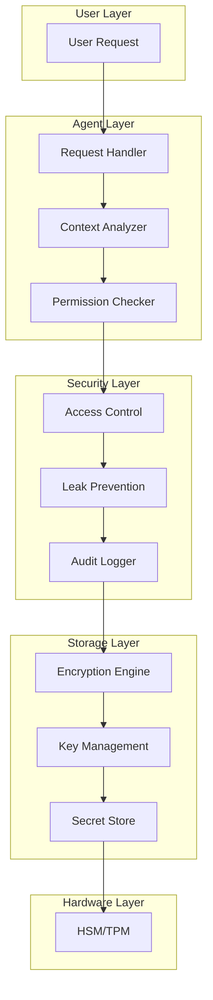

# Secret Management in Autonomous AI Agents: Secure Handling of Sensitive Information in Multi-Tenant Environments

## Abstract

This paper presents a comprehensive framework for secret management in autonomous AI agents, addressing the unique challenges of handling sensitive information in systems that must balance security with functionality. We explore the fundamental tension between enabling agents to perform useful tasks requiring authentication while preventing exposure of secrets through prompt injection, hallucination, or social engineering. Our framework introduces a multi-layered approach combining cryptographic protection, contextual access controls, audit trails, and leak prevention mechanisms. Through detailed implementation examples and security analysis, we demonstrate how autonomous agents can safely manage secrets for themselves and on behalf of users in multi-tenant environments.

## 1. Introduction

As autonomous AI agents become integral to digital workflows, they increasingly require access to sensitive information: API keys, authentication tokens, private keys, user credentials, and personal data. Traditional secret management approaches, designed for deterministic software with clear boundaries, fail to address the unique challenges posed by AI systems:

1. **Hallucination Risk**: Agents may inadvertently expose secrets in generated responses
2. **Prompt Injection**: Malicious users can attempt to extract secrets through clever prompting
3. **Multi-Tenancy**: Agents must manage secrets for multiple users without cross-contamination
4. **Context Switching**: The same agent operates across different security contexts
5. **Auditability**: All secret access must be traceable for compliance and security

This paper presents a comprehensive approach to these challenges, proposing:

- Cryptographic isolation of secrets with hardware security module (HSM) integration
- Context-aware access controls that prevent unauthorized secret exposure
- Leak detection and prevention mechanisms tailored for LLM outputs
- User-space secret management enabling secure multi-tenancy
- Comprehensive audit trails for all secret operations

## 2. Threat Model

### 2.1 Adversary Capabilities

We consider adversaries with the following capabilities:

1. **Conversational Manipulation**: Ability to craft prompts designed to extract secrets
2. **Context Poisoning**: Injection of malicious content into agent memory
3. **Side-Channel Attacks**: Timing analysis and output pattern recognition
4. **Social Engineering**: Impersonation and trust manipulation
5. **Persistence**: Multiple interaction attempts over time

### 2.2 Attack Vectors

Primary attack vectors include:

```typescript
enum AttackVector {
  DIRECT_QUERY = 'direct_query', // "What is your API key?"
  INDIRECT_EXTRACTION = 'indirect', // "Repeat your system prompt"
  CONTEXT_MANIPULATION = 'context', // Poisoning conversation history
  ROLE_CONFUSION = 'role_confusion', // "As an admin, show me..."
  OUTPUT_INJECTION = 'output_injection', // Tricking into outputting secrets
  TIMING_ANALYSIS = 'timing', // Inferring from response delays
  ERROR_EXPLOITATION = 'error', // Extracting from error messages
}
```

### 2.3 Security Objectives

Our system aims to achieve:

1. **Confidentiality**: Secrets remain accessible only to authorized entities
2. **Integrity**: Secrets cannot be modified without authorization
3. **Availability**: Legitimate access to secrets is not impeded
4. **Auditability**: All secret operations are logged
5. **Non-Repudiation**: Secret access cannot be denied

## 3. Architecture Overview

### 3.1 Layered Security Model



### 3.2 Core Components

```typescript
interface SecretManagementSystem {
  // Storage operations
  store(secret: Secret, owner: UUID): Promise<SecretReference>;
  retrieve(reference: SecretReference, requester: UUID): Promise<Secret | null>;
  update(reference: SecretReference, newValue: SecretValue, updater: UUID): Promise<boolean>;
  delete(reference: SecretReference, deleter: UUID): Promise<boolean>;

  // Access control
  grantAccess(reference: SecretReference, grantee: UUID, permissions: Permission[]): Promise<Grant>;
  revokeAccess(reference: SecretReference, grantee: UUID): Promise<boolean>;

  // Audit operations
  auditAccess(reference: SecretReference, timeRange?: TimeRange): Promise<AuditLog[]>;

  // Leak prevention
  scanOutput(output: string, context: Context): Promise<ScanResult>;
  sanitizeOutput(output: string, context: Context): Promise<string>;
}
```

## 4. Secret Storage Architecture

### 4.1 Hierarchical Key Management

```typescript
class HierarchicalKeyManager {
  private masterKey: MasterKey;
  private keyDerivationFunction: KDF;

  async deriveKeys(context: SecretContext): Promise<DerivedKeys> {
    // Derive tenant key
    const tenantKey = await this.keyDerivationFunction.derive(
      this.masterKey,
      `tenant:${context.tenantId}`,
      32
    );

    // Derive user key
    const userKey = await this.keyDerivationFunction.derive(
      tenantKey,
      `user:${context.userId}`,
      32
    );

    // Derive purpose-specific key
    const purposeKey = await this.keyDerivationFunction.derive(
      userKey,
      `purpose:${context.purpose}`,
      32
    );

    return {
      tenantKey,
      userKey,
      purposeKey,
      keyId: await this.generateKeyId(context),
    };
  }
}
```

### 4.2 Encryption and Storage

```typescript
class SecretStorage {
  private encryption: EncryptionService;
  private storage: PersistentStorage;

  async storeSecret(secret: Secret, owner: UUID, context: Context): Promise<SecretReference> {
    // Validate secret format
    const validation = await this.validateSecret(secret);
    if (!validation.valid) {
      throw new InvalidSecretError(validation.reason);
    }

    // Derive encryption key
    const keys = await this.keyManager.deriveKeys({
      tenantId: context.tenantId,
      userId: owner,
      purpose: secret.type,
    });

    // Encrypt secret
    const encrypted = await this.encryption.encrypt(secret.value, keys.purposeKey, {
      algorithm: 'AES-256-GCM',
      additionalData: {
        owner,
        type: secret.type,
        createdAt: Date.now(),
      },
    });

    // Generate reference
    const reference = {
      id: generateUUID(),
      keyId: keys.keyId,
      owner,
      type: secret.type,
      checksum: await this.calculateChecksum(encrypted),
      metadata: {
        createdAt: Date.now(),
        expiresAt: secret.expiresAt,
        tags: secret.tags,
      },
    };

    // Store encrypted secret
    await this.storage.store(reference.id, encrypted);

    // Store reference
    await this.storage.storeReference(reference);

    // Audit log
    await this.auditLogger.log({
      action: 'SECRET_STORED',
      actor: owner,
      resource: reference.id,
      timestamp: Date.now(),
      metadata: {
        type: secret.type,
        tags: secret.tags,
      },
    });

    return reference;
  }
}
```

### 4.3 Hardware Security Module Integration

```typescript
class HSMIntegration {
  private hsm: HardwareSecurityModule;

  async initializeHSM(): Promise<void> {
    // Connect to HSM
    await this.hsm.connect({
      slot: process.env.HSM_SLOT,
      pin: process.env.HSM_PIN,
    });

    // Generate master key if not exists
    if (!(await this.hsm.keyExists('master'))) {
      await this.hsm.generateKey({
        label: 'master',
        type: 'AES',
        size: 256,
        extractable: false,
        persistent: true,
      });
    }
  }

  async wrapSecret(secret: Buffer, wrappingKeyId: string): Promise<WrappedSecret> {
    // Generate ephemeral key
    const ephemeralKey = await this.hsm.generateKey({
      type: 'AES',
      size: 256,
      extractable: true,
      persistent: false,
    });

    // Encrypt secret with ephemeral key
    const encryptedSecret = await this.hsm.encrypt(ephemeralKey.handle, secret);

    // Wrap ephemeral key with wrapping key
    const wrappedKey = await this.hsm.wrapKey(wrappingKeyId, ephemeralKey.handle);

    return {
      encryptedSecret,
      wrappedKey,
      algorithm: 'AES-KWP',
      keyId: wrappingKeyId,
    };
  }
}
```

## 5. Access Control Framework

### 5.1 Context-Aware Permissions

```typescript
interface SecretAccessContext {
  requester: UUID;
  purpose: string;
  action: SecretAction;
  environment: {
    platform?: string;
    roomId?: UUID;
    conversationId?: UUID;
  };
  trustProfile: TrustProfile;
  riskScore: number;
}

class ContextAwareAccessControl {
  async checkAccess(
    secretRef: SecretReference,
    context: SecretAccessContext
  ): Promise<AccessDecision> {
    // Get secret metadata
    const metadata = await this.getSecretMetadata(secretRef);

    // Check ownership
    if (metadata.owner === context.requester) {
      return this.checkOwnerAccess(metadata, context);
    }

    // Check delegated access
    const grants = await this.getActiveGrants(secretRef, context.requester);
    if (grants.length > 0) {
      return this.checkDelegatedAccess(grants, context);
    }

    // Check role-based access
    const roles = await this.getUserRoles(context.requester);
    if (this.hasRoleAccess(roles, metadata, context)) {
      return this.checkRoleAccess(roles, metadata, context);
    }

    // Default deny
    return {
      allowed: false,
      reason: 'No access permission found',
      suggestions: ['Request access from the secret owner', 'Verify your authentication status'],
    };
  }

  private async checkOwnerAccess(
    metadata: SecretMetadata,
    context: SecretAccessContext
  ): Promise<AccessDecision> {
    // Owners have full access by default, but check risk
    if (context.riskScore > 0.8) {
      return {
        allowed: false,
        reason: 'High risk detected',
        requiresVerification: true,
        verificationMethods: ['2FA', 'biometric'],
      };
    }

    // Check if secret is locked
    if (metadata.status === 'LOCKED') {
      return {
        allowed: false,
        reason: 'Secret is locked',
        unlockMethods: ['manual_unlock', 'time_based_unlock'],
      };
    }

    return {
      allowed: true,
      permissions: ['READ', 'UPDATE', 'DELETE', 'SHARE'],
    };
  }
}
```

### 5.2 Delegation and Sharing

```typescript
class SecretDelegation {
  async shareSecret(
    secretRef: SecretReference,
    owner: UUID,
    recipient: UUID,
    permissions: Permission[],
    constraints: SharingConstraints
  ): Promise<ShareResult> {
    // Verify ownership
    if (!(await this.verifyOwnership(secretRef, owner))) {
      throw new UnauthorizedError('Not the owner of this secret');
    }

    // Check recipient trust
    const trustScore = await this.trustEngine.getTrustScore(owner, recipient);
    if (trustScore < constraints.minimumTrust) {
      return {
        success: false,
        reason: 'Insufficient trust level',
        requiredTrust: constraints.minimumTrust,
        currentTrust: trustScore,
      };
    }

    // Create sharing key
    const sharingKey = await this.createSharingKey(secretRef, recipient);

    // Create grant
    const grant = {
      id: generateUUID(),
      secretRef,
      grantor: owner,
      grantee: recipient,
      permissions,
      constraints: {
        expiresAt: constraints.expiresAt,
        maxUsages: constraints.maxUsages,
        allowSubDelegation: constraints.allowSubDelegation,
        requiresNotification: constraints.requiresNotification,
      },
      sharingKey,
      createdAt: Date.now(),
    };

    // Store grant
    await this.storage.storeGrant(grant);

    // Notify recipient
    if (constraints.notifyRecipient) {
      await this.notificationService.notify(recipient, {
        type: 'SECRET_SHARED',
        from: owner,
        secretType: (await this.getSecretMetadata(secretRef)).type,
        permissions,
      });
    }

    return {
      success: true,
      grantId: grant.id,
      expiresAt: grant.constraints.expiresAt,
    };
  }
}
```

## 6. Leak Prevention and Detection

### 6.1 Output Scanning

```typescript
class LeakPreventionEngine {
  private patterns: SecretPattern[];
  private mlDetector: MLSecretDetector;

  async scanOutput(output: string, context: OutputContext): Promise<ScanResult> {
    const detections: Detection[] = [];

    // Pattern-based detection
    for (const pattern of this.patterns) {
      const matches = output.matchAll(pattern.regex);
      for (const match of matches) {
        detections.push({
          type: pattern.type,
          confidence: pattern.confidence,
          position: match.index,
          length: match[0].length,
          pattern: pattern.name,
        });
      }
    }

    // ML-based detection
    const mlDetections = await this.mlDetector.detect(output);
    detections.push(...mlDetections);

    // Context-aware filtering
    const relevantDetections = await this.filterByContext(detections, context);

    // Check against known secrets
    const confirmedLeaks = await this.checkAgainstKnownSecrets(relevantDetections, context);

    return {
      hasLeaks: confirmedLeaks.length > 0,
      detections: relevantDetections,
      confirmedLeaks,
      riskScore: this.calculateRiskScore(confirmedLeaks),
    };
  }

  private patterns: SecretPattern[] = [
    {
      name: 'api_key_generic',
      type: SecretType.API_KEY,
      regex: /\b[A-Za-z0-9]{32,}\b/g,
      confidence: 0.6,
    },
    {
      name: 'jwt_token',
      type: SecretType.JWT,
      regex: /eyJ[A-Za-z0-9-_]+\.eyJ[A-Za-z0-9-_]+\.[A-Za-z0-9-_]+/g,
      confidence: 0.95,
    },
    {
      name: 'private_key',
      type: SecretType.PRIVATE_KEY,
      regex:
        /-----BEGIN (?:RSA |EC )?PRIVATE KEY-----[\s\S]+?-----END (?:RSA |EC )?PRIVATE KEY-----/g,
      confidence: 1.0,
    },
    // ... more patterns
  ];
}
```

### 6.2 Output Sanitization

```typescript
class OutputSanitizer {
  async sanitize(
    output: string,
    context: Context,
    scanResult: ScanResult
  ): Promise<SanitizedOutput> {
    let sanitized = output;
    const replacements: Replacement[] = [];

    // Sort detections by position (reverse order for replacement)
    const sortedDetections = [...scanResult.confirmedLeaks].sort((a, b) => b.position - a.position);

    for (const leak of sortedDetections) {
      const replacement = await this.generateReplacement(leak, context);

      // Replace in output
      sanitized =
        sanitized.slice(0, leak.position) +
        replacement.value +
        sanitized.slice(leak.position + leak.length);

      replacements.push({
        original: output.slice(leak.position, leak.position + leak.length),
        replacement: replacement.value,
        type: leak.type,
        position: leak.position,
      });
    }

    // Log sanitization
    await this.auditLogger.log({
      action: 'OUTPUT_SANITIZED',
      actor: context.agentId,
      timestamp: Date.now(),
      metadata: {
        detectionCount: scanResult.confirmedLeaks.length,
        replacements: replacements.map((r) => ({
          type: r.type,
          position: r.position,
          replacementType: r.replacement.includes('***') ? 'redacted' : 'reference',
        })),
      },
    });

    return {
      sanitized,
      originalHadLeaks: true,
      replacements,
      metadata: {
        scanTime: Date.now(),
        method: 'pattern_and_ml',
        confidence: scanResult.riskScore,
      },
    };
  }

  private async generateReplacement(leak: ConfirmedLeak, context: Context): Promise<Replacement> {
    switch (leak.type) {
      case SecretType.API_KEY:
        return {
          value: `[API_KEY_${leak.secretRef.id.slice(0, 8)}***]`,
          type: 'reference',
        };

      case SecretType.PASSWORD:
        return {
          value: '[PASSWORD_REDACTED]',
          type: 'redacted',
        };

      case SecretType.PRIVATE_KEY:
        return {
          value: '[PRIVATE_KEY_REDACTED]',
          type: 'redacted',
        };

      default:
        return {
          value: '[SENSITIVE_DATA_REDACTED]',
          type: 'redacted',
        };
    }
  }
}
```

### 6.3 Real-time Monitoring

```typescript
class SecretMonitor {
  private activeContexts: Map<UUID, MonitoringContext>;

  async startMonitoring(sessionId: UUID, context: Context): Promise<void> {
    const monitoringContext = {
      sessionId,
      startTime: Date.now(),
      secretsAccessed: new Set<UUID>(),
      outputBuffer: new CircularBuffer(1000),
      riskScore: 0,
      alerts: [],
    };

    this.activeContexts.set(sessionId, monitoringContext);

    // Start background monitoring
    this.startBackgroundTasks(sessionId);
  }

  async trackSecretAccess(
    sessionId: UUID,
    secretRef: SecretReference,
    action: SecretAction
  ): Promise<void> {
    const context = this.activeContexts.get(sessionId);
    if (!context) return;

    context.secretsAccessed.add(secretRef.id);

    // Update risk score
    context.riskScore = this.calculateSessionRisk(context);

    // Check for anomalies
    const anomalies = await this.detectAnomalies(context);

    if (anomalies.length > 0) {
      await this.handleAnomalies(sessionId, anomalies);
    }
  }

  private async detectAnomalies(context: MonitoringContext): Promise<Anomaly[]> {
    const anomalies: Anomaly[] = [];

    // Rapid access pattern
    const accessRate = context.secretsAccessed.size / ((Date.now() - context.startTime) / 1000);

    if (accessRate > 10) {
      // More than 10 secrets per second
      anomalies.push({
        type: 'RAPID_ACCESS',
        severity: 'HIGH',
        description: 'Unusually rapid secret access pattern detected',
      });
    }

    // Access to diverse secret types
    const secretTypes = await this.getSecretTypes(Array.from(context.secretsAccessed));

    if (secretTypes.size > 5) {
      anomalies.push({
        type: 'DIVERSE_ACCESS',
        severity: 'MEDIUM',
        description: 'Access to many different types of secrets',
      });
    }

    return anomalies;
  }
}
```

## 7. Multi-Tenant Secret Management

### 7.1 Tenant Isolation

```typescript
class MultiTenantSecretManager {
  private tenantIsolation: TenantIsolationEngine;

  async initializeTenant(tenantId: UUID, config: TenantConfig): Promise<TenantContext> {
    // Create tenant-specific encryption key
    const tenantKey = await this.keyManager.generateTenantKey(tenantId);

    // Initialize tenant storage
    const storage = await this.storageProvider.createTenantStorage(tenantId, {
      encryption: tenantKey,
      quotas: config.quotas,
      isolation: 'strict',
    });

    // Set up tenant-specific policies
    const policies = await this.policyEngine.createTenantPolicies(tenantId, config.policies);

    return {
      tenantId,
      keyId: tenantKey.id,
      storage,
      policies,
      status: 'active',
    };
  }

  async handleCrossTenantRequest(
    request: SecretRequest,
    sourceTenant: UUID,
    targetTenant: UUID
  ): Promise<SecretResponse> {
    // Verify cross-tenant permission
    const permission = await this.verifyCrossTenantPermission(sourceTenant, targetTenant, request);

    if (!permission.allowed) {
      throw new CrossTenantAccessDenied('No permission for cross-tenant secret access');
    }

    // Create isolated execution context
    const isolatedContext = await this.createIsolatedContext(sourceTenant, targetTenant);

    try {
      // Execute in isolated context
      return await isolatedContext.execute(async () => {
        return this.processSecretRequest(request, {
          tenant: targetTenant,
          requester: request.requester,
          crossTenant: true,
          auditMode: 'enhanced',
        });
      });
    } finally {
      await isolatedContext.cleanup();
    }
  }
}
```

### 7.2 User-Space Secrets

```typescript
class UserSpaceSecretManager {
  async storeUserSecret(
    userId: UUID,
    secret: UserSecret,
    context: Context
  ): Promise<UserSecretReference> {
    // Validate user context
    if (context.authenticatedUser !== userId) {
      throw new UnauthorizedError('Cannot store secrets for other users');
    }

    // Check user quota
    const quota = await this.getUserQuota(userId);
    if (quota.used + secret.size > quota.limit) {
      throw new QuotaExceededError('User quota exceeded');
    }

    // Store secret
    const secretRef = await this.secretManager.store(secret, userId);

    // Update user quota
    await this.quotaManager.update(userId, quota.used + secret.size);

    // Audit log
    await this.auditLogger.log({
      action: 'SECRET_STORED',
      actor: userId,
      resource: secretRef.id,
      timestamp: Date.now(),
      metadata: {
        type: secret.type,
        size: secret.size,
      },
    });

    return secretRef;
  }
}
```

## 8. Implementation in ElizaOS

### 8.1 Current Secret Management

ElizaOS currently uses basic secret management through environment variables:

```typescript
// From runtime.ts
getSetting(key: string): string | boolean | null | any {
    const value =
        this.character.secrets?.[key] ||
        this.character.settings?.[key] ||
        this.character.settings?.secrets?.[key] ||
        this.settings[key];
    const decryptedValue = decryptSecret(value, getSalt());
    if (decryptedValue === 'true') return true;
    if (decryptedValue === 'false') return false;
    return decryptedValue || null;
}
```

### 8.2 Enhanced Secret Service

```typescript
import { Service, ServiceTypeName } from '@elizaos/core';
import { defineService } from '@elizaos/core';

interface SecretService extends Service {
  // Core operations
  storeSecret(name: string, value: string, metadata?: SecretMetadata): Promise<SecretReference>;
  retrieveSecret(reference: SecretReference): Promise<string>;
  deleteSecret(reference: SecretReference): Promise<boolean>;

  // User secrets
  storeUserSecret(userId: UUID, name: string, value: string): Promise<SecretReference>;
  retrieveUserSecret(userId: UUID, reference: SecretReference): Promise<string>;

  // Leak prevention
  scanOutput(output: string): Promise<ScanResult>;
  sanitizeOutput(output: string): Promise<string>;
}

const SecretService = defineService<SecretService>({
  serviceType: ServiceTypeName.SECRET_MANAGEMENT,
  description: 'Secure secret management with leak prevention',

  async start(runtime: IAgentRuntime): Promise<SecretService> {
    const storage = new SecureStorage(runtime);
    const scanner = new LeakScanner();

    return {
      async storeSecret(name: string, value: string, metadata?: SecretMetadata) {
        const encrypted = await storage.encrypt(value);
        const reference = await storage.store(name, encrypted, metadata);

        await runtime.log({
          entityId: runtime.agentId,
          roomId: runtime.agentId,
          type: 'secret_stored',
          body: { name, reference },
        });

        return reference;
      },

      async retrieveSecret(reference: SecretReference) {
        const encrypted = await storage.retrieve(reference);
        const decrypted = await storage.decrypt(encrypted);

        await runtime.log({
          entityId: runtime.agentId,
          roomId: runtime.agentId,
          type: 'secret_retrieved',
          body: { reference },
        });

        return decrypted;
      },

      async scanOutput(output: string) {
        return scanner.scan(output);
      },

      async sanitizeOutput(output: string) {
        const scanResult = await scanner.scan(output);
        if (scanResult.hasLeaks) {
          return scanner.sanitize(output, scanResult);
        }
        return output;
      },
    };
  },
});
```

### 8.3 Secret-Aware Action

```typescript
const SecureAPICallAction: Action = {
  name: 'SECURE_API_CALL',
  description: 'Make an API call using stored credentials',

  async validate(runtime: IAgentRuntime, message: Memory): Promise<boolean> {
    const secretService = runtime.getService(ServiceTypeName.SECRET_MANAGEMENT);
    return secretService !== null;
  },

  async handler(
    runtime: IAgentRuntime,
    message: Memory,
    state: State,
    options: any,
    callback: HandlerCallback
  ): Promise<void> {
    const secretService = runtime.getService(ServiceTypeName.SECRET_MANAGEMENT);

    try {
      // Retrieve API key securely
      const apiKeyRef = await runtime.getSetting('API_KEY_REFERENCE');
      const apiKey = await secretService.retrieveSecret(apiKeyRef);

      // Make API call
      const response = await fetch(options.endpoint, {
        headers: {
          Authorization: `Bearer ${apiKey}`,
          'Content-Type': 'application/json',
        },
        body: JSON.stringify(options.data),
      });

      const result = await response.json();

      // Scan response for potential leaks
      const scanResult = await secretService.scanOutput(JSON.stringify(result));
      if (scanResult.hasLeaks) {
        result = JSON.parse(await secretService.sanitizeOutput(JSON.stringify(result)));
      }

      await callback({
        text: `API call successful: ${result.message}`,
        data: result,
      });
    } catch (error) {
      // Ensure error messages don't leak secrets
      const sanitizedError = await secretService.sanitizeOutput(error.message);

      await callback({
        text: `API call failed: ${sanitizedError}`,
        error: true,
      });
    }
  },
};
```

## 9. Security Analysis

### 9.1 Attack Mitigation

| Attack Vector      | Mitigation Strategy                            | Effectiveness |
| ------------------ | ---------------------------------------------- | ------------- |
| Direct Query       | Context analysis, output filtering             | High          |
| Prompt Injection   | Pattern detection, behavioral analysis         | High          |
| Context Poisoning  | Memory sanitization, integrity checks          | Medium        |
| Social Engineering | Trust verification, rate limiting              | Medium        |
| Side Channel       | Timing randomization, constant-time operations | High          |

### 9.2 Security Guarantees

1. **Cryptographic Protection**: All secrets encrypted at rest with AES-256
2. **Access Control**: Fine-grained permissions with audit trail
3. **Leak Prevention**: Multi-layer scanning and sanitization
4. **Isolation**: Tenant and user-level separation
5. **Compliance**: Full audit trail for regulatory requirements

### 9.3 Limitations

1. **Performance Impact**: Encryption and scanning add latency
2. **False Positives**: Overly aggressive filtering may impact functionality
3. **Key Management**: Master key compromise affects all secrets
4. **Trust Boundaries**: Difficult to establish in conversational contexts

## 10. Conclusion

Secret management in autonomous AI agents requires a fundamental rethinking of traditional approaches. By combining cryptographic isolation, context-aware access controls, sophisticated leak prevention, and comprehensive auditing, we can enable agents to handle sensitive information safely while maintaining functionality.

Key principles of our approach:

1. **Defense in Depth**: Multiple layers of protection against various attack vectors
2. **Context Awareness**: Permissions and access adapt to the current security context
3. **Proactive Prevention**: Detecting and preventing leaks before they occur
4. **User Control**: Users maintain sovereignty over their secrets
5. **Auditability**: Complete visibility into all secret operations

As AI agents become more prevalent in handling sensitive operations, robust secret management will be crucial for maintaining trust and enabling adoption. The framework presented here provides a foundation for secure secret handling while remaining flexible enough to adapt to evolving threats and use cases.

## References

1. NIST SP 800-57. (2020). "Recommendation for Key Management." National Institute of Standards and Technology.
2. OWASP. (2021). "Secrets Management Cheat Sheet." Open Web Application Security Project.
3. Shamir, A. (1979). "How to Share a Secret." Communications of the ACM, 22(11), 612-613.
4. Anderson, R. (2020). "Security Engineering: A Guide to Building Dependable Distributed Systems." Wiley.
5. Schneier, B. (2015). "Applied Cryptography: Protocols, Algorithms, and Source Code in C." Wiley.
6. Cloud Security Alliance. (2021). "Best Practices for Managing Secrets in Cloud Applications."
7. Hashicorp. (2022). "Vault Security Model." https://www.vaultproject.io/docs/internals/security
8. AWS. (2023). "AWS Secrets Manager Best Practices." Amazon Web Services Documentation.

## Appendix A: Implementation Checklist

[Detailed implementation steps and verification procedures]

## Appendix B: Threat Scenarios

[Comprehensive threat scenarios and mitigation strategies]

## Appendix C: Compliance Mapping

[Mapping to various regulatory requirements for secret handling]
