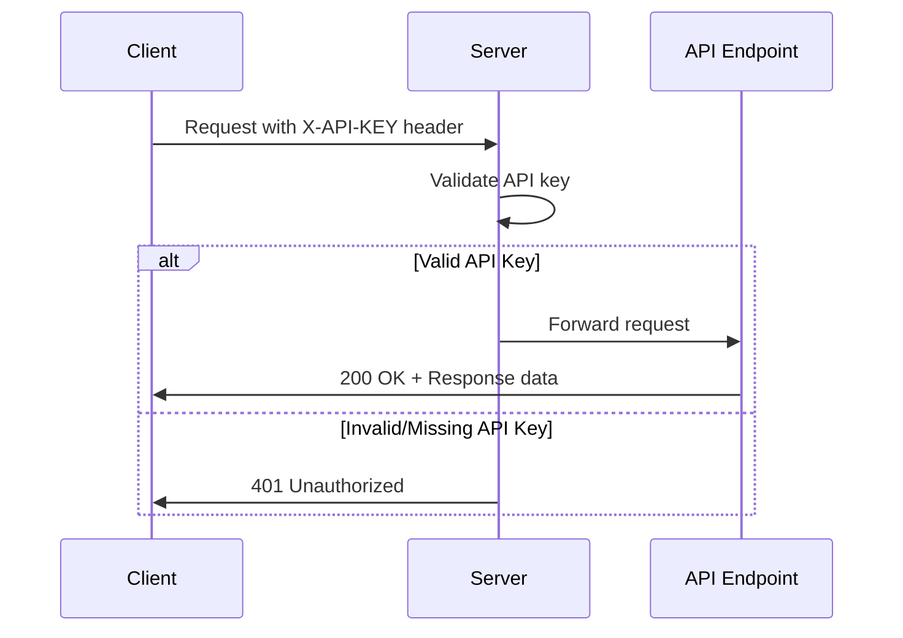

# Authentication & API Keys

The ElizaOS REST API supports API key authentication to secure your endpoints. This guide covers how to configure and use authentication for your ElizaOS server.

## Overview

ElizaOS uses a simple but effective API key authentication mechanism. When enabled, all `/api/*` routes require a valid API key to be provided in the request headers.

## Configuration

### Setting Up Authentication

Authentication is controlled by the `ELIZA_SERVER_AUTH_TOKEN` environment variable:

```bash
# Enable authentication by setting a secure API key
ELIZA_SERVER_AUTH_TOKEN=your-secret-api-key-here

# Leave unset or empty to disable authentication (not recommended for production)
ELIZA_SERVER_AUTH_TOKEN=
```

:::warning Security Best Practice
Always enable authentication in production environments. Generate a strong, random API key using a secure method:

```bash
# Generate a secure random API key
openssl rand -base64 32
```

:::

### Environment Variables

| Variable                  | Description                             | Default              |
| ------------------------- | --------------------------------------- | -------------------- |
| `ELIZA_SERVER_AUTH_TOKEN` | The API key required for authentication | None (auth disabled) |

## Using Authentication

### Request Headers

When authentication is enabled, include the API key in your requests using the `X-API-KEY` header:

```bash
curl -H "X-API-KEY: your-secret-api-key-here" \
     http://localhost:3000/api/agents
```

### JavaScript/TypeScript Example

```typescript
const response = await fetch('http://localhost:3000/api/agents', {
  headers: {
    'X-API-KEY': 'your-secret-api-key-here',
    'Content-Type': 'application/json',
  },
});
```

### Python Example

```python
import requests

headers = {
    'X-API-KEY': 'your-secret-api-key-here',
    'Content-Type': 'application/json'
}

response = requests.get('http://localhost:3000/api/agents', headers=headers)
```

## Authentication Flow

1. **Client sends request** with `X-API-KEY` header
2. **Server validates** the API key against `ELIZA_SERVER_AUTH_TOKEN`
3. **If valid**, request proceeds to the endpoint
4. **If invalid or missing**, server returns 401 Unauthorized



## Special Cases

### CORS Preflight Requests

OPTIONS requests for CORS preflight are always allowed through without authentication:

```javascript
// CORS preflight requests bypass authentication
if (req.method === 'OPTIONS') {
  return next();
}
```

### Public Endpoints

Currently, when authentication is enabled, it applies to all `/api/*` routes. There are no public API endpoints when authentication is active.

## Error Responses

### Missing or Invalid API Key

When a request is made without a valid API key, the server responds with:

```json
{
  "status": 401,
  "message": "Unauthorized: Invalid or missing X-API-KEY"
}
```

The server also logs the unauthorized access attempt:

```
[WARN] Unauthorized access attempt: Missing or invalid X-API-KEY from 192.168.1.100
```

## Security Considerations

### API Key Storage

- **Never commit** API keys to version control
- **Use environment variables** or secure secret management systems
- **Rotate keys regularly** in production environments
- **Use different keys** for different environments (dev, staging, prod)

### Network Security

- **Use HTTPS** in production to encrypt API keys in transit
- **Implement IP whitelisting** at the network level for additional security
- **Monitor access logs** for unauthorized attempts

### Key Generation Best Practices

Generate strong API keys with sufficient entropy:

```bash
# Good: High entropy random key
openssl rand -base64 32

# Good: UUID v4
uuidgen

# Bad: Predictable or weak keys
# "admin123", "secret", "test-key"
```

## Monitoring & Logging

The server logs all authentication failures for security monitoring:

```log
[2024-01-15 10:23:45] WARN: Unauthorized access attempt: Missing or invalid X-API-KEY from 192.168.1.100
[2024-01-15 10:24:12] WARN: Unauthorized access attempt: Missing or invalid X-API-KEY from 10.0.0.50
```

Monitor these logs to detect:

- Brute force attempts
- Misconfigured clients
- Potential security threats

## Migration Guide

### Enabling Authentication on Existing Deployments

1. **Generate a secure API key**

   ```bash
   export ELIZA_SERVER_AUTH_TOKEN=$(openssl rand -base64 32)
   ```

2. **Update your environment configuration**

   ```bash
   # .env file
   ELIZA_SERVER_AUTH_TOKEN=your-generated-key-here
   ```

3. **Update all API clients** to include the X-API-KEY header

4. **Test thoroughly** before deploying to production

5. **Monitor logs** for any failed authentication attempts from missed clients

## Troubleshooting

### Common Issues

1. **"Unauthorized: Invalid or missing X-API-KEY"**

   - Verify the API key is correctly set in environment variables
   - Ensure the X-API-KEY header is included in requests
   - Check for typos in the API key

2. **Authentication works locally but not in production**

   - Verify environment variables are properly set in production
   - Check for proxy/load balancer header stripping
   - Ensure HTTPS is properly configured

3. **CORS errors with authentication**
   - CORS preflight (OPTIONS) requests are exempt from authentication
   - Ensure your CORS configuration includes the X-API-KEY header in allowed headers

### Debug Mode

Enable debug logging to troubleshoot authentication issues:

```bash
LOG_LEVEL=debug ELIZA_SERVER_AUTH_TOKEN=test-key npm start
```

## See Also

- [Rate Limiting](./rate-limiting.md) - Protect your API from abuse
- [CORS Configuration](./cors.md) - Configure cross-origin requests
- [Security Headers](./security-headers.md) - Additional security measures
