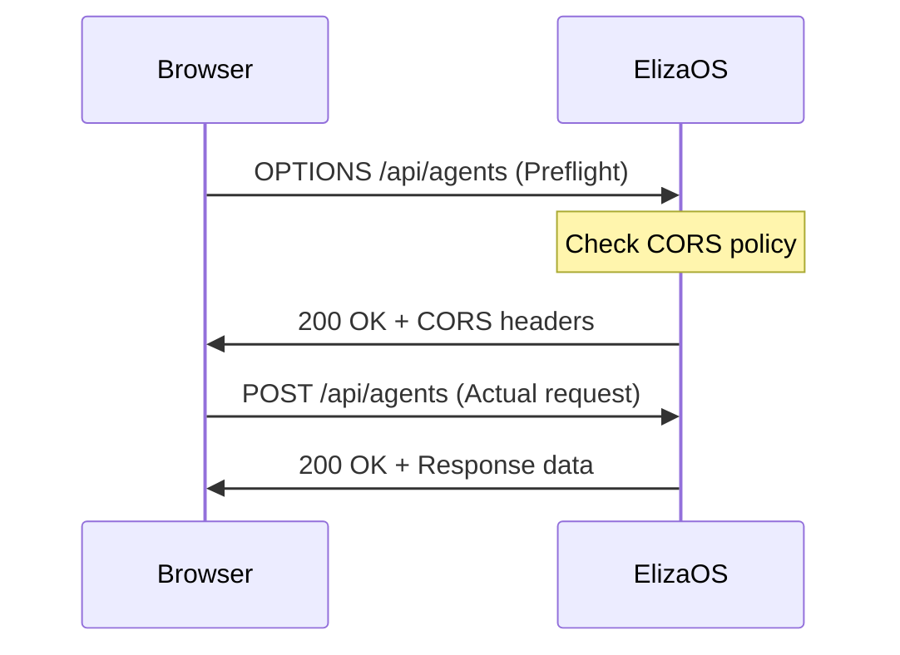

# CORS Configuration

Cross-Origin Resource Sharing (CORS) configuration in ElizaOS allows web applications from different domains to interact with your API. This guide covers how CORS is configured and how to customize it for your needs.

## Default Configuration

By default, ElizaOS is configured with permissive CORS settings for development:

```javascript
{
  origin: process.env.CORS_ORIGIN || true,
  credentials: true,
  methods: ['GET', 'POST', 'PUT', 'DELETE', 'PATCH', 'OPTIONS'],
  allowedHeaders: ['Content-Type', 'Authorization', 'X-API-KEY']
}
```

:::warning Production Warning
The default configuration allows all origins (`origin: true`). Always configure specific origins in production environments.
:::

## Configuration Options

### Environment Variables

Configure CORS using environment variables:

```bash
# Allow specific origin
CORS_ORIGIN=https://app.example.com

# Allow multiple origins (comma-separated)
CORS_ORIGIN=https://app.example.com,https://admin.example.com

# Allow all origins (not recommended for production)
CORS_ORIGIN=*
```

### Allowed Origins

#### Single Origin

```bash
CORS_ORIGIN=https://app.example.com
```

#### Multiple Origins

For multiple allowed origins, ElizaOS processes comma-separated values:

```bash
CORS_ORIGIN=https://app.example.com,https://admin.example.com,http://localhost:3000
```

#### Dynamic Origin Validation

You can implement dynamic origin validation by modifying the server configuration:

```javascript
const corsOptions = {
  origin: (origin, callback) => {
    // Allow requests with no origin (mobile apps, Postman, etc.)
    if (!origin) return callback(null, true);

    const allowedOrigins = [
      'https://app.example.com',
      'https://admin.example.com',
      /^https:\/\/.*\.example\.com$/, // Wildcard subdomains
    ];

    const isAllowed = allowedOrigins.some((allowed) => {
      if (allowed instanceof RegExp) {
        return allowed.test(origin);
      }
      return allowed === origin;
    });

    if (isAllowed) {
      callback(null, true);
    } else {
      callback(new Error('Not allowed by CORS'));
    }
  },
  credentials: true,
};
```

## CORS Headers

### Request Headers

The following headers are allowed in cross-origin requests:

- `Content-Type`
- `Authorization`
- `X-API-KEY`

### Response Headers

ElizaOS sets these CORS response headers:

```http
Access-Control-Allow-Origin: https://app.example.com
Access-Control-Allow-Credentials: true
Access-Control-Allow-Methods: GET, POST, PUT, DELETE, PATCH, OPTIONS
Access-Control-Allow-Headers: Content-Type, Authorization, X-API-KEY
```

## Preflight Requests

CORS preflight requests (OPTIONS) are automatically handled:



### Preflight Bypass

Preflight requests bypass authentication for CORS compatibility:

```javascript
if (req.method === 'OPTIONS') {
  return next(); // Skip auth for preflight
}
```

## Common CORS Scenarios

### 1. Local Development

For local development with a frontend on a different port:

```bash
# Frontend on localhost:5173, API on localhost:3000
CORS_ORIGIN=http://localhost:5173
```

### 2. Production Single Domain

For a production app with frontend and API on different subdomains:

```bash
# Frontend: https://app.example.com
# API: https://api.example.com
CORS_ORIGIN=https://app.example.com
```

### 3. Multiple Applications

For multiple frontends accessing the same API:

```bash
CORS_ORIGIN=https://app.example.com,https://admin.example.com,https://mobile.example.com
```

### 4. Mobile Applications

Mobile apps typically don't send an Origin header:

```javascript
// Server configuration to allow mobile apps
{
  origin: (origin, callback) => {
    // Allow requests with no origin
    if (!origin) return callback(null, true);

    // Check against allowed origins
    if (allowedOrigins.includes(origin)) {
      callback(null, true);
    } else {
      callback(new Error('Not allowed by CORS'));
    }
  };
}
```

## Socket.IO CORS

Socket.IO has separate CORS configuration:

```javascript
const io = new SocketIOServer(server, {
  cors: {
    origin: '*', // Configure appropriately for production
    methods: ['GET', 'POST'],
  },
});
```

For production, align Socket.IO CORS with your main API:

```javascript
const io = new SocketIOServer(server, {
  cors: {
    origin: process.env.CORS_ORIGIN || '*',
    methods: ['GET', 'POST'],
    credentials: true,
  },
});
```

## Troubleshooting CORS Issues

### Common Problems

#### 1. "No 'Access-Control-Allow-Origin' header"

**Symptom:**

```
Access to fetch at 'http://localhost:3000/api/agents' from origin 'http://localhost:5173'
has been blocked by CORS policy: No 'Access-Control-Allow-Origin' header is present
```

**Solution:**

- Set `CORS_ORIGIN` environment variable
- Ensure the origin includes protocol and port
- Check server logs for CORS errors

#### 2. "CORS header 'Access-Control-Allow-Credentials' is 'true'"

**Symptom:**

```
The value of the 'Access-Control-Allow-Credentials' header in the response is 'true'
which must be 'true' when the request's credentials mode is 'include'
```

**Solution:**

- Include `credentials: 'include'` in fetch requests
- Ensure cookies are being sent properly
- Set `CORS_ORIGIN` to specific origin (not `*`)

#### 3. "Method not allowed by CORS"

**Symptom:**

```
Method DELETE is not allowed by Access-Control-Allow-Methods in preflight response
```

**Solution:**

- Verify the HTTP method is in the allowed methods list
- Check if custom middleware is overriding CORS settings

### Debug Mode

Enable CORS debugging by adding logging:

```javascript
app.use((req, res, next) => {
  console.log('CORS Debug:', {
    origin: req.headers.origin,
    method: req.method,
    headers: req.headers,
  });
  next();
});
```

### Testing CORS

Test CORS configuration using curl:

```bash
# Test preflight request
curl -X OPTIONS http://localhost:3000/api/agents \
  -H "Origin: https://app.example.com" \
  -H "Access-Control-Request-Method: POST" \
  -H "Access-Control-Request-Headers: X-API-KEY" \
  -v

# Test actual request
curl -X POST http://localhost:3000/api/agents \
  -H "Origin: https://app.example.com" \
  -H "X-API-KEY: your-api-key" \
  -v
```

## Security Considerations

### 1. Avoid Wildcard Origins in Production

```bash
# Bad for production
CORS_ORIGIN=*

# Good for production
CORS_ORIGIN=https://app.example.com
```

### 2. Validate Origin Patterns

When using regex patterns, be specific:

```javascript
// Too broad - matches any domain
/^https:\/\/.*$/

// Better - only matches your subdomains
/^https:\/\/([a-z0-9]+\.)?example\.com$/
```

### 3. Credentials and Wildcards

You cannot use wildcard origins with credentials:

```javascript
// This won't work
{
  origin: '*',
  credentials: true // Error!
}

// Use specific origins with credentials
{
  origin: 'https://app.example.com',
  credentials: true
}
```

### 4. Limit Exposed Headers

Only expose necessary headers to the client:

```javascript
{
  exposedHeaders: ['X-Total-Count', 'X-Page-Number'];
}
```

## Best Practices

1. **Always specify exact origins in production**

   ```bash
   CORS_ORIGIN=https://app.production.com
   ```

2. **Use environment-specific configurations**

   ```bash
   # .env.development
   CORS_ORIGIN=http://localhost:5173

   # .env.production
   CORS_ORIGIN=https://app.example.com
   ```

3. **Implement origin validation for complex scenarios**

   ```javascript
   const isOriginAllowed = (origin) => {
     const allowed = process.env.CORS_ORIGIN.split(',');
     return allowed.includes(origin);
   };
   ```

4. **Monitor CORS violations**
   ```javascript
   app.use((err, req, res, next) => {
     if (err && err.message === 'Not allowed by CORS') {
       logger.warn(`CORS violation from origin: ${req.headers.origin}`);
     }
     next(err);
   });
   ```

## See Also

- [Authentication](./authentication.md) - API authentication setup
- [Security Headers](./security-headers.md) - Additional security configurations
- [Rate Limiting](./rate-limiting.md) - Request throttling and limits
