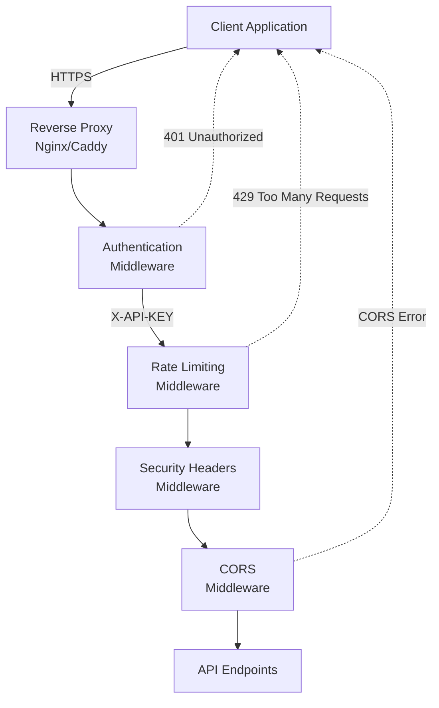

# REST API Security Overview

ElizaOS provides comprehensive security features to protect your API endpoints, data, and users. This documentation covers all aspects of API security, from authentication to advanced threat protection.

## Security Features at a Glance

### 🔐 Authentication

- **API Key Authentication**: Simple, effective authentication using `X-API-KEY` headers
- **Environment-based Configuration**: Secure token management via environment variables
- **CORS Preflight Support**: Seamless integration with web applications

### 🚦 Rate Limiting

- **Tiered Rate Limits**: Different limits for different operation types
- **IP-based Tracking**: Automatic request tracking per IP address
- **Customizable Windows**: Configurable time windows and request limits
- **Special Handling**: File operations and uploads have stricter limits

### 🛡️ Security Headers

- **Content Security Policy (CSP)**: Protection against XSS attacks
- **HSTS**: Force HTTPS connections in production
- **Frame Options**: Clickjacking protection
- **Additional Headers**: MIME sniffing prevention, XSS filters, and more

### 🌐 CORS Configuration

- **Flexible Origin Control**: Configure allowed origins via environment variables
- **Credential Support**: Full support for authenticated cross-origin requests
- **Method Control**: Specify allowed HTTP methods
- **Header Whitelisting**: Control which headers can be sent cross-origin

## Quick Start Security Setup

### 1. Basic Authentication

```bash
# Generate a secure API key
export ELIZA_SERVER_AUTH_TOKEN=$(openssl rand -base64 32)

# Start the server with authentication enabled
npm start
```

### 2. Configure CORS for Your Frontend

```bash
# Allow your frontend domain
export CORS_ORIGIN=https://app.example.com

# Or multiple domains
export CORS_ORIGIN=https://app.example.com,https://admin.example.com
```

### 3. Production Configuration

```bash
# .env.production
NODE_ENV=production
ELIZA_SERVER_AUTH_TOKEN=your-secure-token-here
CORS_ORIGIN=https://app.example.com
ELIZA_UI_ENABLE=false
SERVER_HOST=127.0.0.1
```

## Security Architecture



## Security Layers

### 1. Network Layer

- HTTPS encryption (TLS 1.2+)
- Reverse proxy configuration
- Firewall rules
- IP whitelisting (optional)

### 2. Application Layer

- API key authentication
- Request rate limiting
- Input validation
- Security headers

### 3. Data Layer

- Parameterized queries
- Connection encryption
- Access control
- Audit logging

## Common Security Scenarios

### Public API with Rate Limiting

```javascript
// No authentication, but protected by rate limits
const publicApiConfig = {
  rateLimit: {
    windowMs: 15 * 60 * 1000,
    max: 100, // 100 requests per 15 minutes
  },
  cors: {
    origin: '*', // Allow all origins
  },
};
```

### Private API with Full Security

```javascript
// Full security for private APIs
const privateApiConfig = {
  authentication: {
    required: true,
    headerName: 'X-API-KEY',
  },
  rateLimit: {
    windowMs: 15 * 60 * 1000,
    max: 1000,
  },
  cors: {
    origin: 'https://app.example.com',
    credentials: true,
  },
};
```

### Internal API with IP Restrictions

```javascript
// Internal API with IP whitelisting
const internalApiConfig = {
  authentication: {
    required: true,
  },
  ipWhitelist: ['10.0.0.0/8', '172.16.0.0/12'],
  cors: {
    origin: false, // No CORS needed for internal
  },
};
```

## Monitoring and Alerts

ElizaOS logs security events for monitoring:

```log
[2024-01-15 10:23:45] WARN: [SECURITY] Unauthorized access attempt from 192.168.1.100
[2024-01-15 10:24:12] WARN: [SECURITY] Rate limit exceeded for IP: 10.0.0.50
[2024-01-15 10:25:33] WARN: [SECURITY] Suspicious User-Agent from 172.16.0.10
[2024-01-15 10:26:01] WARN: [SECURITY] SQL injection pattern detected from 203.0.113.0
```

## API Documentation Guide

### Core Documentation

1. **[API Endpoints](./endpoints.md)** - Complete REST API endpoint reference
2. **[Error Responses](./error-responses.md)** - Standardized error format and codes

### Security Documentation

1. **[Authentication](./authentication.md)** - Set up API key authentication
2. **[Rate Limiting](./rate-limiting.md)** - Configure request throttling
3. **[CORS Configuration](./cors.md)** - Set up cross-origin requests
4. **[Security Headers](./security-headers.md)** - Understand security headers
5. **[Security Best Practices](./security-best-practices.md)** - Production security guide

## Quick Security Checklist

Before deploying to production:

- [ ] Generate strong API key using cryptographic methods
- [ ] Configure CORS for specific origins only
- [ ] Enable HTTPS with valid certificates
- [ ] Set `NODE_ENV=production`
- [ ] Disable web UI with `ELIZA_UI_ENABLE=false`
- [ ] Configure reverse proxy (Nginx/Caddy)
- [ ] Set up monitoring for security events
- [ ] Review rate limits for your use case
- [ ] Test security headers with online tools
- [ ] Implement backup and recovery procedures

## Getting Help

### Security Issues

If you discover a security vulnerability:

1. **DO NOT** open a public issue
2. Email security concerns to the maintainers
3. Include detailed steps to reproduce
4. Allow time for a fix before disclosure

### Community Resources

- [GitHub Discussions](https://github.com/elizaos/eliza/discussions) - Ask security questions
- [Discord Server](https://discord.gg/elizaos) - Real-time help
- [Security Updates](https://github.com/elizaos/eliza/security) - Security advisories

## Next Steps

1. Start with [Authentication](./authentication.md) to secure your API
2. Configure [Rate Limiting](./rate-limiting.md) to prevent abuse
3. Set up [CORS](./cors.md) for web applications
4. Review [Security Best Practices](./security-best-practices.md) for production
