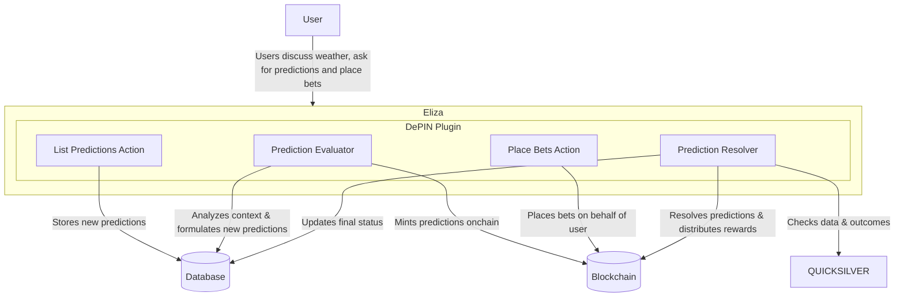

# `@elizaos/plugin-depin`

The **`@elizaos/plugin-depin`** plugin empowers the Eliza Agent Framework with **Perception** and **Action** capabilities via DePINs, bridging the digital intelligence of AI with the physical world.

- **DePINs as "Senses and Actuators":** Enables real-time data access from decentralized sensors and control over physical devices.
- **Unlock Transformative Use Cases:** From drone delivery to smart city infrastructure and precision agriculture, this plugin extends your AI agents' potential.

Leverage **`@elizaos/plugin-depin`** to integrate AI agents with the real world seamlessly.

---

## Configuration

### Environment Variables

Add the following to your `.env` file:

```env
QUICKSILVER_URL=http://localhost:8000 # Optional, defaults to "https://quicksilver.iotex.ai"

<!-- If using prediction market -->
BINARY_PREDICTION_CONTRACT_ADDRESS=Your Binary Prediction Market Contract Address
PREDICTION_NETWORK=Your Prediction Market Network
PREDICTION_TOKEN=Your Prediction Market Token Address
MAX_ONGOING_PREDICTIONS=20 # Optional, defaults to 20
```

### Character Configuration

Update character.json with the following:

```json
"plugins": [
    "@elizaos/plugin-depin"
]
```

### QuickSilver

For the best experience you can run your own instance of [QuickSilver](https://github.com/iotexproject/quicksilver).

## Providers

### DePINScan

The DePINScan provider fetches and caches data from the IoTeX DePINScan API, providing:

- **Daily Metrics**: Latest aggregated statistics about DePIN activity on IoTeX
- **Project Data**: Detailed information about DePIN projects including:
    - Project name and slug
    - Token details and market metrics
    - Device statistics (total devices, costs, earnings)
    - Layer 1 chains and categories
    - Market data (market cap, token price, FDV)

## Actions

### Depin Projects

The DEPIN_PROJECTS action analyzes and provides information about DePIN projects tracked by DePINScan. It can:

- Query token prices, market caps, and valuations
- Compare metrics between different projects
- Filter projects by categories and chains
- Provide device statistics and earnings data
- Answer questions about specific project details

### Current Weather and Weather Forecast

The CURRENT_WEATHER action fetches and analyzes weather data for a given location using Mapbox and Nubila APIs. It can:

- Provide current temperature, weather conditions, and forecasts
- Answer questions about weather patterns and trends
- Generate weather-themed memes and images

## Predictions



### Configuration

#### Contract Deployment

- **Deploy the PredictionMarket contract** on your desired network. You can find the contract in /contracts/PredictionMarket.sol. Disclaimer: This contract is not audited and should be used at your own risk. The owner of the contract should be the agent.
- **Set the contract address** in your .env file.
- **Set the token address** in your .env file.
- **Set the network** in your .env file.
- **Set the max ongoing predictions** in your .env file.
- **Update prediction abi** in /src/contracts/predictionAbi.ts if the contract has been modified.

### Actions

#### List Predictions

Lists all active predictions from the database

#### Prepare Bet

The PREPARE_BET action (also known as APPROVE_BET) handles the first step of the betting process by:

1. **Token Approval**: Generates the necessary transaction data for users to approve the ERC20 token contract to spend tokens on their behalf
2. **Bet Validation**: Validates and processes bet parameters including:
    - Prediction ID: The unique identifier of the prediction being bet on
    - Amount: How many $SENTAI tokens to bet
    - Outcome: The predicted outcome (true/false)
    - Bettor Address: The user's wallet address

**Usage Example:**

```
"PREPARE A BET FOR PREDICTION 1, 100 $SENTAI, true, 0x742d35Cc6634C0532925a3b844Bc454e4438f44e"
```

The action will respond with:

- A unique Bet ID
- Transaction data for token approval
- Instructions for confirming the approval

**Note:** This is a two-step process:

1. First approve the token spending (this action)
2. Then place the actual bet using the PLACE_BET action after approval

#### Place Bet

The PLACE_BET action executes the second and final step of the betting process after token approval is confirmed. It:

1. **Validates the Approval**: Verifies the provided transaction hash of the token approval
2. **Executes the Bet**: Places the bet on-chain with the previously approved parameters:
    - Prediction ID
    - Bet amount in $SENTAI
    - Chosen outcome (Yes/No)
    - Bettor's wallet address

**Usage Example:**

```
"BET 123 APPROVED: 0x1234567890abcdef1234567890abcdef1234567890abcdef1234567890abcdef"
```

The action will:

- Confirm the approval transaction
- Execute the bet on-chain
- Return a confirmation with:
    - Prediction statement
    - Your bet choice (Yes/No)
    - Bet amount
    - Bettor address
    - Transaction hash

**Note:** This action should only be used after successfully completing the PREPARE_BET step and receiving confirmation of the token approval transaction.

### Evaluators

#### Prediction Evaluator

The Prediction Evaluator is an automated system that analyzes conversations to identify and create new weather-related predictions. It:

- **Monitors Conversations**: Continuously scans discussions for predictive statements about weather
- **Mints Predictions**: Automatically creates predictions on-chain
- **Manages Prediction Lifecycle**:
    - Validates prediction statements
    - Sets appropriate deadlines
    - Tracks prediction status
    - Limits the number of active predictions

### Services

#### Prediction Resolver

The Prediction Resolver is an automated service that validates and resolves weather-related predictions using real-world data. It:

- **Monitors Active Predictions**: Checks for predictions ready to be resolved every minute
- **Validates Outcomes**:
    - Fetches current weather data via QUICKSILVER
    - Compares prediction statements against actual conditions
    - Determines true/false outcomes automatically
- **Resolves On-Chain**:
    - Updates prediction status in the blockchain
    - Triggers reward distribution to winning bettors
    - Updates prediction status in the database
