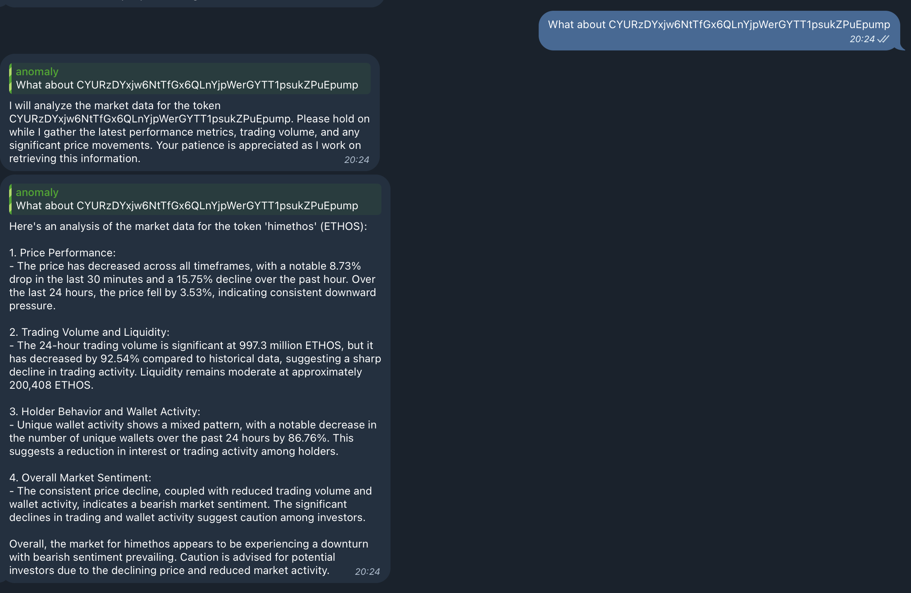

# @ethosdao/plugin-market-analisys

    
     
     
    <a href="https://ethosdao.ai">🌐 EthosDAO Website</a>
     

# Description

This plugin enables your agent to get comprehensive market data for any token using Birdeye API.

# Actions

- **tokenOverview**: Provides an overview of a token's market data.

# Requirements

- Birdeye API Key

# Setup

1. Navigate your character file and add the `"BIRDEYE_API_KEY"` to the `"secrets"` property.
2. Add "@ethosdao/plugin-market-analisys" to `"dependencies"` property in `eliza/agent/package.json`.
3. Add `import { pluginMarketAnalisys } from "@ethosdao/plugin-market-analisys";` in `eliza/agent/src/index.ts`.
4. Add the following parameter `getSecret(character, "BIRDEYE_API_KEY") ? marketAnalisysPlugin : null,` in the `plugins` array in `eliza/agent/src/index.ts`.

# Example

