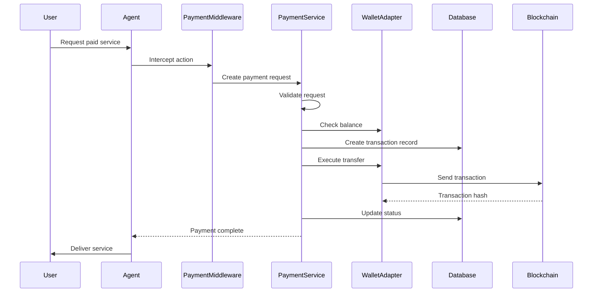

# @elizaos/plugin-payment

A comprehensive payment processing plugin for ElizaOS that enables agents to monetize services through blockchain-based payments. The plugin provides a flexible middleware system, multi-chain wallet integration, price oracle services, and database-backed transaction management.

## Table of Contents

- [Overview](#overview)
- [Architecture](#architecture)
- [Features](#features)
- [Installation](#installation)
- [Configuration](#configuration)
- [Quick Start](#quick-start)
- [Core Components](#core-components)
- [Wallet Adapters](#wallet-adapters)
- [Database Schema](#database-schema)
- [Payment Flow](#payment-flow)
- [API Reference](#api-reference)
- [Examples](#examples)
- [Testing](#testing)
- [Troubleshooting](#troubleshooting)

## Overview

The payment plugin is a sophisticated financial infrastructure layer for ElizaOS agents that enables:

- **Service Monetization**: Wrap any action with payment requirements
- **Multi-Chain Support**: EVM chains (Ethereum, Polygon, Arbitrum, Optimism, Base), Solana, and Coinbase AgentKit
- **Flexible Payment Processing**: Supports immediate payments, confirmations, and trust-based exemptions
- **Database-Backed**: PostgreSQL integration for transaction history, user wallets, and payment settings
- **Price Oracle**: Real-time token price fetching with caching
- **Custodial Wallet Management**: Secure wallet creation and management per user

## Architecture

```
┌─────────────────────┐
│   Agent Actions     │
├─────────────────────┤
│ Payment Middleware  │ ← Wraps actions with payment requirements
├─────────────────────┤
│  Payment Service    │ ← Core payment orchestration
├─────────────────────┤
│ Wallet Adapters     │ ← Chain-specific implementations
├─────────────────────┤
│   Database Layer    │ ← PostgreSQL via Drizzle ORM
└─────────────────────┘
```

### Key Services

1. **PaymentService**: Main orchestrator for payment processing
2. **PriceOracleService**: Token price fetching and caching
3. **UniversalPaymentService**: Unified wallet interface (implements IUniversalWalletService)

### Wallet Adapters

- **EVMWalletAdapter**: Ethereum and EVM-compatible chains
- **SolanaWalletAdapter**: Solana blockchain integration
- **AgentKitWalletAdapter**: Coinbase Developer Platform integration
- **CrossmintAdapter**: NFT and payment infrastructure

## Features

### Payment Processing
- Automatic balance checking before payment execution
- Configurable payment confirmations
- Trust-based payment exemptions (owners, admins)
- Daily spending limits
- Transaction monitoring and status updates

### Multi-Currency Support
- USDC (Ethereum & Solana)
- Native tokens (ETH, SOL, MATIC, etc.)
- Layer 2 tokens (ARB, OP, BASE)
- Automatic currency conversion via price oracles

### Database Integration
- Transaction history tracking
- User wallet management
- Payment request queue
- Daily spending tracking
- Price caching
- Webhook support

### Security Features
- Encrypted private key storage
- Trust score integration
- Confirmation codes for high-value transactions
- Role-based payment exemptions

## Installation

```bash
npm install @elizaos/plugin-payment
```

### Prerequisites

1. **PostgreSQL Database**: Required for transaction storage
2. **Wallet Plugin**: At least one wallet plugin (@elizaos/plugin-evm, @elizaos/plugin-solana, or @elizaos/plugin-agentkit)
3. **Node.js 18+**

## Configuration

### Environment Variables

```bash
# Payment Settings
PAYMENT_AUTO_APPROVAL_ENABLED=false
PAYMENT_AUTO_APPROVAL_THRESHOLD=10
PAYMENT_DEFAULT_CURRENCY=USDC
PAYMENT_REQUIRE_CONFIRMATION=true
PAYMENT_TRUST_THRESHOLD=70
PAYMENT_MAX_DAILY_SPEND=1000
PAYMENT_PREFERRED_NETWORKS=ethereum,solana
PAYMENT_FEE_STRATEGY=standard

# Price Oracle
COINGECKO_API_KEY=your-api-key-here

# Chain RPC URLs (optional - defaults provided)
ETH_RPC_URL=https://eth.llamarpc.com
POLYGON_RPC_URL=https://polygon-rpc.com
ARBITRUM_RPC_URL=https://arb1.arbitrum.io/rpc
OPTIMISM_RPC_URL=https://mainnet.optimism.io
BASE_RPC_URL=https://mainnet.base.org
SOLANA_RPC_URL=https://api.mainnet-beta.solana.com
```

### Plugin Registration

```typescript
import { paymentPlugin } from '@elizaos/plugin-payment';
import { evmPlugin } from '@elizaos/plugin-evm';
import { solanaPlugin } from '@elizaos/plugin-solana';

const agent = new Agent({
  plugins: [
    paymentPlugin,
    evmPlugin, // Required for EVM chains
    solanaPlugin, // Required for Solana
  ],
  databaseAdapter: new PostgresDatabaseAdapter({
    // Your database config
  }),
});
```

## Quick Start

### 1. Basic Payment Middleware

```typescript
import { createPaymentMiddleware, PaymentMethod } from '@elizaos/plugin-payment';

// Your action handler
const myActionHandler = async (runtime, message, state, options, callback) => {
  // Perform your action logic
  await callback({ text: "Service completed successfully!" });
  return true;
};

// Wrap with payment requirement
const paidActionHandler = createPaymentMiddleware({
  amount: BigInt(1000000), // 1 USDC (6 decimals)
  method: PaymentMethod.USDC_ETH,
  requiresConfirmation: false, // Auto-approve small amounts
  skipForOwner: true, // Owners don't pay
  metadata: {
    service: 'premium-analysis',
    validityPeriod: 3600000, // 1 hour
  }
})(myActionHandler);

// Register as action
export const paidAction: Action = {
  name: 'PREMIUM_ANALYSIS',
  handler: paidActionHandler,
  description: 'Premium analysis service (costs 1 USDC)',
  // ... other action properties
};
```

### 2. Manual Payment Processing

```typescript
import { IPaymentService, PaymentRequest } from '@elizaos/plugin-payment';

const paymentService = runtime.getService('payment') as IPaymentService;

const request: PaymentRequest = {
  id: generateUUID(),
  userId: message.userId,
  agentId: runtime.agentId,
  actionName: 'custom-service',
  amount: BigInt(5000000), // 5 USDC
  method: PaymentMethod.USDC_ETH,
  recipientAddress: '0x...', // Your payment address
  requiresConfirmation: true,
  metadata: {
    description: 'Premium API access',
  }
};

const result = await paymentService.processPayment(request, runtime);

if (result.status === PaymentStatus.COMPLETED) {
  // Payment successful
} else if (result.status === PaymentStatus.PENDING) {
  // Awaiting confirmation
}
```

## Core Components

### PaymentService

The main payment orchestrator that handles:

- Payment request validation
- Balance checking
- Transaction execution
- Status monitoring
- Database operations
- Event emission

```typescript
class PaymentService extends Service implements IPaymentService {
  // Processes payment requests through validation, confirmation, and execution
  async processPayment(request: PaymentRequest, runtime: IAgentRuntime): Promise<PaymentResult>
  
  // Monitors pending transactions and updates their status
  private async checkPendingTransactions(): Promise<void>
  
  // Creates user wallets if they don't exist
  private async getUserWallet(userId: UUID, method: PaymentMethod): Promise<WalletInfo>
}
```

### Payment Middleware

The middleware intercepts action execution to require payment:

```typescript
export function createPaymentMiddleware(options: PaymentMiddlewareOptions) {
  return async (runtime, message, state, callback, next) => {
    // 1. Check if payment should be skipped (owner/admin)
    // 2. Check for recent valid payment
    // 3. Create payment request
    // 4. Process payment
    // 5. Execute original action on success
  };
}
```

### PriceOracleService

Manages token prices with multiple data sources:

```typescript
class PriceOracleService extends Service implements IPriceOracleService {
  // Fetches from CoinGecko API, plugin oracles, or cache
  async getTokenPrice(address: string, network: string): Promise<TokenPrice>
  
  // Converts token amounts to USD
  async convertToUSD(amount: bigint, method: PaymentMethod): Promise<number>
  
  // Caches prices in database with expiration
  async updatePriceCache(price: TokenPrice): Promise<void>
}
```

## Wallet Adapters

### EVMWalletAdapter

Supports all EVM-compatible chains using ethers.js:

- **Networks**: Ethereum, Polygon, Arbitrum, Optimism, Base
- **Features**: Native token transfers, ERC20 token support, gas estimation
- **Integration**: Works with @elizaos/plugin-evm wallet service

### SolanaWalletAdapter

Integrates with Solana blockchain:

- **Networks**: Solana mainnet/devnet
- **Features**: SOL transfers, SPL token support, custodial wallet integration
- **Integration**: Works with @elizaos/plugin-solana custodial service

### AgentKitWalletAdapter

Coinbase Developer Platform integration:

- **Networks**: Base, Ethereum
- **Features**: MPC wallets, secure key management, CDP integration
- **Integration**: Works with @elizaos/plugin-agentkit

## Database Schema

The plugin uses PostgreSQL with Drizzle ORM for data persistence:

### Tables

1. **payment_transactions**: Complete transaction history
2. **payment_requests**: Pending payment requests
3. **user_wallets**: User wallet addresses and encrypted keys
4. **payment_settings**: Per-agent configuration
5. **daily_spending**: Spending limit tracking
6. **price_cache**: Token price caching
7. **payment_webhooks**: Webhook configurations

### Key Relationships

```sql
payment_requests.transaction_id → payment_transactions.id
user_wallets.user_id → (user UUID)
daily_spending.user_id → (user UUID)
payment_webhooks.payment_id → payment_transactions.id
```

## Payment Flow

### Standard Payment Flow



### Confirmation Flow

For high-value transactions or when confirmation is required:

1. Payment request created with PENDING status
2. Confirmation task created (if task service available)
3. User confirms via code or secure form
4. Payment executed upon confirmation
5. Original action executed

## API Reference

### IPaymentService Interface

```typescript
interface IPaymentService {
  // Process a payment request
  processPayment(request: PaymentRequest, runtime: IAgentRuntime): Promise<PaymentResult>;
  
  // Check payment status
  checkPaymentStatus(paymentId: UUID, runtime: IAgentRuntime): Promise<PaymentStatus>;
  
  // Get user balances across all methods
  getUserBalance(userId: UUID, runtime: IAgentRuntime): Promise<Map<PaymentMethod, bigint>>;
  
  // Get payment history
  getPaymentHistory(
    userId: UUID, 
    limit: number, 
    offset: number, 
    runtime: IAgentRuntime
  ): Promise<PaymentResult[]>;
  
  // Cancel pending payment
  cancelPayment(paymentId: UUID): Promise<boolean>;
  
  // Confirm pending payment
  confirmPayment(paymentId: UUID, confirmation: PaymentConfirmation): Promise<PaymentResult>;
}
```

### PaymentMiddlewareOptions

```typescript
interface PaymentMiddlewareOptions {
  amount: bigint;                    // Amount in smallest unit
  method?: PaymentMethod;            // Default: USDC_ETH
  requiresConfirmation?: boolean;    // Require user confirmation
  trustRequired?: boolean;           // Check trust score
  minimumTrustLevel?: number;        // Min trust score required
  skipForOwner?: boolean;            // Skip payment for owners
  skipForAdmin?: boolean;            // Skip payment for admins
  metadata?: Record<string, any>;    // Additional metadata
}
```

## Examples

### Research Action (Built-in)

The plugin includes a complete research action example:

```typescript
// User: "research quantum computing"
// Agent: "This research service costs 1 USDC..."
// [Payment processed automatically]
// Agent: "Here are the research results..."
```

### Custom Paid Service

```typescript
const translationAction: Action = {
  name: 'TRANSLATE_DOCUMENT',
  handler: createPaymentMiddleware({
    amount: BigInt(2000000), // 2 USDC
    method: PaymentMethod.USDC_SOL,
    metadata: {
      service: 'translation',
      ratePerWord: 0.01,
    }
  })(async (runtime, message, state, options, callback) => {
    const document = message.content.text;
    const translation = await translateDocument(document);
    
    await callback({
      text: `Translation complete:\n\n${translation}`,
      metadata: { 
        wordCount: document.split(' ').length,
        language: 'es'
      }
    });
  })
};
```

### Subscription Service

```typescript
const subscriptionMiddleware = createPaymentMiddleware({
  amount: BigInt(10000000), // 10 USDC
  method: PaymentMethod.USDC_ETH,
  metadata: {
    service: 'premium-subscription',
    validityPeriod: 30 * 24 * 60 * 60 * 1000, // 30 days
  }
});

// Recent payments within validity period are automatically accepted
```

## Testing

The plugin includes comprehensive test scenarios:

- **Basic Payment Flow**: Standard payment processing
- **Trust Exemptions**: Role-based payment skipping
- **Confirmation Flow**: High-value payment confirmations
- **Insufficient Funds**: Error handling
- **Multi-Currency**: Different payment methods
- **Real Integration**: End-to-end blockchain tests

Run tests:

```bash
npm test
```

## Troubleshooting

### Common Issues

1. **"Payment service not available"**
   - Ensure payment plugin is registered
   - Check database connection
   - Verify wallet plugin is loaded

2. **"Insufficient funds"**
   - Check wallet balance
   - Verify correct payment method
   - Ensure wallet has gas for fees

3. **"Transaction pending"**
   - Monitor blockchain confirmations
   - Check RPC endpoint status
   - Verify gas settings

### Debug Logging

Enable detailed logging:

```typescript
import { elizaLogger } from '@elizaos/core';
elizaLogger.level = 'debug';
```

### Database Queries

Check payment status:

```sql
SELECT * FROM payment_transactions 
WHERE payer_id = 'user-uuid' 
ORDER BY created_at DESC;
```

## Security Considerations

1. **Private Key Management**: Keys are encrypted in database
2. **Trust Integration**: Respect role-based permissions
3. **Confirmation Codes**: Time-limited and single-use
4. **Daily Limits**: Prevent excessive spending
5. **Webhook Security**: Validate webhook signatures

## Future Enhancements

- [ ] Recurring payment support
- [ ] Multi-signature wallets
- [ ] Escrow services
- [ ] Payment streaming
- [ ] Cross-chain swaps
- [ ] Fiat on/off ramps
- [ ] Invoice generation
- [ ] Tax reporting

## Contributing

Contributions welcome! Please see the main ElizaOS contributing guidelines.

## License

MIT
