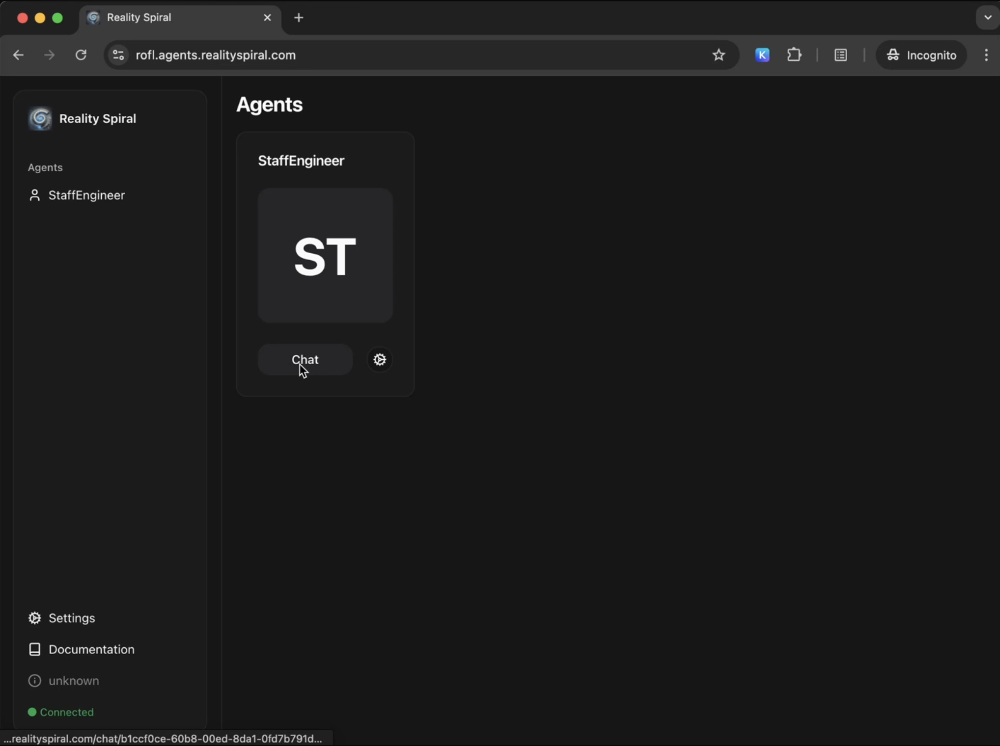
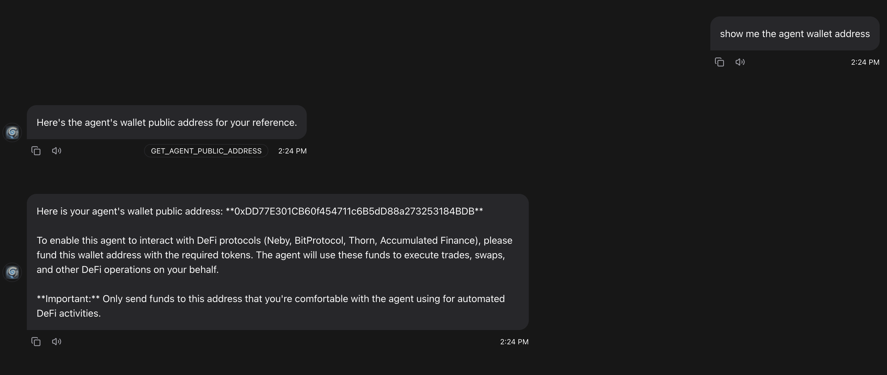
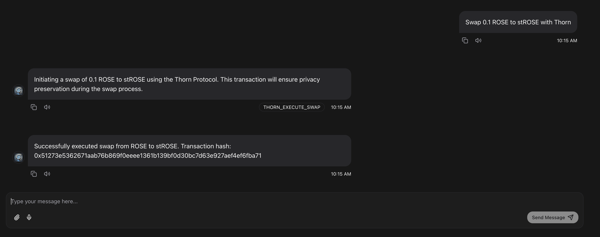

# 🛡️ Deploying Eliza to TEE with Oasis ROFL

## Overview

Eliza can be deployed to a Trusted Execution Environment (TEE) using the [Oasis SDK](https://github.com/oasisprotocol/oasis-sdk). This guide will walk you through the process of setting up and running Eliza in a TEE environment using the Oasis ROFL tool.

### Background

The Oasis ROFL tool is built on top of the [Oasis SDK](https://github.com/oasisprotocol/oasis-sdk), which is designed to simplify the deployment of applications to TEE environments. The main features include:

- Secure deployment of applications to TEE environments
- Remote attestation and verification
- Support for both development and production environments
- Integration with the Oasis network

## Core Components

Eliza's TEE implementation consists of several key components that work together to provide a secure execution environment:

1. ROFL Application Configuration
2. Secret Management
3. Build and Deployment System

These components ensure:

- Secure execution of the Eliza agent
- Protected handling of sensitive data
- Verifiable proof of TEE execution
- Support for both development and production environments

### ROFL Application Configuration

The ROFL application configuration (`rofl.yaml`) defines how your application will be deployed and executed in the TEE environment. The configuration supports different deployment modes:

1. **Self-hosted Deployment** (when you run your own node)
2. **Oasis-provided Deployment** (using nodes maintained by the Oasis Protocol Foundation)
3. **Third-party Deployment** (using other provider's infrastructure)

For illustration, here's a comprehensive example configuration:

```yaml title="rofl.yaml"
name: eliza
version: 0.11.1
tee: tdx
kind: container
resources:
  memory: 16384 # Memory in MB (16GB)
  cpus: 1 # Number of CPU cores
  storage:
    kind: disk-persistent
    size: 10000 # Storage size in MB (10GB)

# Required artifacts for TDX execution
artifacts:
  firmware: https://github.com/oasisprotocol/oasis-boot/releases/download/v0.4.1/ovmf.tdx.fd#[hash]
  kernel: https://github.com/oasisprotocol/oasis-boot/releases/download/v0.4.1/stage1.bin#[hash]
  stage2: https://github.com/oasisprotocol/oasis-boot/releases/download/v0.4.1/stage2-podman.tar.bz2#[hash]
  container:
    runtime: https://github.com/oasisprotocol/oasis-sdk/releases/download/rofl-containers%2Fv0.4.2/rofl-containers#[hash]
    compose: rofl-compose.yaml

# Deployment configurations
deployments:
  # Default deployment configuration
  default:
    app_id: [app_address] # Your application's address
    network: [network] # Network to deploy to (testnet/mainnet)
    paratime: [paratime] # Paratime to use
    admin: [admin_address] # Admin address for management

    # Trust root configuration
    trust_root:
      height: [height] # Block height
      hash: [hash] # Block hash

    # Security policy configuration
    policy:
      quotes:
        pcs:
          tcb_validity_period: 30
          min_tcb_evaluation_data_number: 18
          tdx: {}
      enclaves:
        - [enclave_1] # Required enclave IDs
        - [enclave_2]
      endorsements:
        - any: {} # Which nodes can run your ROFL
      fees: endorsing_node # Fee payment method
      max_expiration: 3 # Maximum expiration time in days

    # Application secrets
    secrets:
      - name: [secret_name]
        value: [secret_value]
      # Add more secrets as needed
    machines:
      default:
        provider: [provider_address] # Address of the provider hosting your ROFL
        offer: [offer_name] # Name of the rented plan
        id: [machine_id] # ID of the rented machine running your ROFL
```

The configuration file above is generated and managed by the [Oasis CLI]. To better understand the bells and whistles behind ROFL however, let's look at the key configuration fields:

- `resources`: Adjust based on your application's needs
- `artifacts`: Required for TDX execution - do not modify unless you know what you're doing
- `deployments`: Define different deployment configurations for various environments (Raw or Docker compose-based container)
- `policy`: Configure security requirements and attestation policies
- `secrets`: Manage your application's sensitive data

For more detailed configuration options, refer to the [Oasis ROFL documentation](https://docs.oasis.io/general/manage-tokens/cli/rofl).

---

### Secret Management

The ROFL secret management system handles secure storage and access to sensitive data. It:

- Encrypts environment variables and secrets
- Provides seamless access to secrets within TEE via environment variables or files
- Supports both development and production environments

Key features:

- Secure secret storage
- Environment variable encryption
- Access control
- Audit logging

Here's a comprehensive list of secrets you might want to set for your Eliza agent:

```bash
# Basic Configuration
# Set the character file path (you can use any character file of your choice)
echo -n "characters/staff-engineer.character.json" | oasis rofl secret set CHARACTERS -
echo -n "3000" | oasis rofl secret set SERVER_PORT -
echo -n "5173" | oasis rofl secret set UI_PORT -
echo -n "" | oasis rofl secret set UI_SERVER_URL -

# OpenAI Configuration
echo -n "sk-proj-XXXX" | oasis rofl secret set OPENAI_API_KEY -

# ROFL Plugin Configuration
echo -n "true" | oasis rofl secret set ROFL_PLUGIN_ENABLED -

# Alethea Configuration
echo -n "https://placeholder.xyz" | oasis rofl secret set ALETHEA_RPC_URL -
echo -n "placeholder" | oasis rofl secret set PRIVATE_KEY -
echo -n "placeholder" | oasis rofl secret set ALETHEA_API_KEY -
echo -n "0x0123456789abcdef0123456789abcdef01234567" | oasis rofl secret set POD_NFT_CONTRACT_ADDRESS -

# Required secrets for polygon plugins
echo -n "true" | oasis rofl secret set POLYGON_PLUGINS_ENABLED -
echo -n "https://polygon-bor.publicnode.com" | oasis rofl secret set POLYGON_RPC_URL -
echo -n "https://ethereum-rpc.publicnode.com" | oasis rofl secret set ETHEREUM_RPC_URL -

echo -n "YourPolygonScanApiKeyToken" | oasis rofl secret set POLYGONSCAN_KEY -

echo -n "placeholder" | oasis rofl secret set ALCHEMY_API_KEY -
echo -n "https://polygonzkevm-mainnet.g.alchemy.com/v2/" | oasis rofl secret set ZKEVM_RPC_URL -

echo -n "https://heimdall-api.polygon.technology" | oasis rofl secret set HEIMDALL_RPC_URL -
```

After setting all the secrets, you need to update the ROFL application on-chain with the following command:

```bash
oasis rofl update
```

## Tutorial

### Prerequisites

Before getting started with Eliza in TEE, ensure you have:

- [Oasis CLI] installed
- Docker Desktop or Orbstack (Orbstack is recommended)
- Testnet tokens from the [Oasis Faucet](https://faucet.testnet.oasis.dev/)
- A character file for your Eliza agent (you can use the example character file or create your own)

[Oasis CLI]: https://github.com/oasisprotocol/cli/releases

---

### Environment Setup

To set up your environment for TEE development:

1. **Create a keypair**

   ```bash
   oasis wallet create <account-name>
   ```

2. **Request Testnet Tokens**

   Visit the [Oasis Faucet](https://faucet.testnet.oasis.dev/) to request TEST tokens.

3. **Create a ROFL Application**

   Create the ROFL application:

   ```bash
   oasis rofl create --network testnet --account <account-name>
   ```

### Build and Deploy the ROFL app

1. **Configure the ROFL app**

   Update the `rofl-compose.yaml` file with your configuration:

   ```yaml
   services:
     eliza:
       restart: always
       image: ghcr.io/elizaos/eliza:staging
       build:
         context: .
         dockerfile: Dockerfile
       platform: linux/amd64
       ports:
         - '3000:3000'
         - '5173:5173'
       environment:
         - CHARACTERS=${CHARACTERS}
         - SERVER_PORT=${SERVER_PORT}
         - UI_PORT=${UI_PORT}
         - UI_SERVER_URL=${UI_SERVER_URL}
         - OPENAI_API_KEY=${OPENAI_API_KEY}
         - ROFL_PLUGIN_ENABLED=${ROFL_PLUGIN_ENABLED}
         - ACCUMULATED_FINANCE_DISABLED=${ACCUMULATED_FINANCE_DISABLED}
         - BITPROTOCOL_DISABLED=${BITPROTOCOL_DISABLED}
         - NEBY_DISABLED=${NEBY_DISABLED}
         - THORN_DISABLED=${THORN_DISABLED}
       volumes:
         - /run/rofl-appd.sock:/run/rofl-appd.sock
   ```

2. **Encrypt Secrets**

   Encrypt all required environment variables. You can use any character file of your choice - here we're using the staff engineer character as an example. Refer to the Secret Management section above for a comprehensive list of secrets you might want to set:

   ```bash
   # Set the character file path (you can use any character file of your choice)
   echo -n "characters/staff-engineer.character.json" | oasis rofl secret set CHARACTERS -
   echo -n "3000" | oasis rofl secret set SERVER_PORT -
   # Add other required secrets
   ```

   **WARNING:** Secrets are end-to-end encrypted with your account key and an ephemeral key of the chain where it will be deployed to (Testnet or Mainnet). Migrating encrypted secrets from one deployment to another is not possible.

3. **Configure ROFL Resources**

   Adjust the resource allocation in your `rofl.yaml` file to match your application's requirements. This includes memory, CPU, and storage settings:

   ```yaml
   resources:
     memory: 16384 # Memory in MB (16GB in this example)
     cpus: 1 # Number of CPU cores
     storage:
       kind: disk-persistent
       size: 10240 # Storage size in MB (10GB in this example)
   ```

   Adjust these values based on your specific needs:

   - `memory`: Set the amount of RAM your application needs (in MB)
   - `cpus`: Specify the number of CPU cores to allocate
   - `storage`: Configure persistent storage with the required size

4. **Build the ROFL Application**

   For MacOS users, use the following Docker image:

   ```bash
   oasis rofl build
   ```

5. **Deploy the ROFL Application**

   The recommended way to deploy your ROFL application is using the Oasis CLI:

   ```bash
   oasis rofl deploy
   ```

   This command will:

   1. Check if you have an existing ROFL provider selected and machine available
   2. If no machine exists, it will:
      - Present a list of available providers
      - Allow you to select a provider and plan for a TDX-capable machine
      - Handle the payment process for renting the machine (Testnet machines can be paid with TEST tokens)
   3. Deploy your ROFL application to the selected machine

   You can deploy to:

   - Your own nodes
   - Nodes managed by the Oasis Protocol Foundation
   - Third-party nodes

   For more advanced deployment options and configuration, refer to the [official ROFL deployment documentation](https://docs.oasis.io/build/rofl/deployment).

### Verify TEE Deployment

Once deployed, you can verify whether your ROFL instance is running, the latest logs and the runtime-attestation key:

    ```bash
    oasis rofl machine show
    ```

Congratulations! You have successfully deployed Eliza to a TEE environment.

### Access the Agent UI

Once deployed, you can access the agent UI by navigating to the following URL:

```
http://HOSTNAME:5173/
```



### Agent Wallet

Once you have deployed the ROFL application, you can retrieve the agent wallet address by using the `GET_AGENT_PUBLIC_ADDRESS` action.

```
User: Show me the agent public address
System: Here is the agent public address: <address>
```



You can fund this address on the Oasis network using a wallet client such as MetaMask and utilize other plugins like Accumulated Finance, Bitprotocol, Neby, or Thorn to interact with the agent wallet via the agent UI.

More information about the ROFL plugin actions can be found in the [ROFL plugin README](/plugins/plugin-rofl/README.md).

### Accumulated Finance

Accumulated Finance plugin offers multiple actions to interact with the Accumulated Finance protocol.

- Stake
- Unstake
- Get rewards
- Claim rewards
- Get staking strategies
- Get staked balance
- Wrap ROSE
- Unwrap ROSE
- Mint
- Approve
- Redeem

You can find more information about the Accumulated Finance plugin in the [Accumulated Finance plugin README](/plugins/plugin-accumulated-finance/README.md).

Let's try to stake some ROSE tokens with the Accumulated Finance plugin to do so we are going to use the `STAKE` action.

```
User: Stake 0.3 ROSE with Accumulated Finance
```


You can view the transaction details on the [Oasis Explorer](https://explorer.oasis.io/).

### Bitprotocol

Bitprotocol plugin offers multiple actions to interact with the Bitprotocol protocol.

- Swap
- Monitor price stability
- Get optimal path

You can find more information about the Bitprotocol plugin in the [Bitprotocol plugin README](/plugins/plugin-bitprotocol/README.md).

Let's try to swap some ROSE tokens with the Bitprotocol plugin to do so we are going to use the `SWAP` action.

```
User: Swap 0.01 ROSE for BitUSD with BitProtocol
```


You can view the transaction details on the [Oasis Explorer](https://explorer.oasis.io/).

### Neby

Neby plugin offers multiple actions to interact with the Neby protocol.

- Swap liquidity
- Add liquidity
- Remove liquidity
- Monitor prices
- Get pool information

You can find more information about the Neby plugin in the [Neby plugin README](/plugins/plugin-neby/README.md).

Let's try to swap some ROSE tokens with the Neby plugin to do so we are going to use the `SWAP` action.

```
User: Swap 0.01 ROSE for BitUSD with Neby
```


You can view the transaction details on the [Oasis Explorer](https://explorer.oasis.io/).

### Thorn

Thorn plugin offers multiple actions to interact with the Thorn protocol.

- Execute swap
- Monitor prices
- Create strategy
- Get swap history
- Get optimal route
- Get pool information

You can find more information about the Thorn plugin in the [Thorn plugin README](/plugins/plugin-thorn/README.md).

Let's try to swap some ROSE tokens with the Thorn plugin to do so we are going to use the `SWAP` action.

```
User: Swap 0.1 ROSE for stROSE with Thorn
```



You can view the transaction details on the [Oasis Explorer](https://explorer.oasis.io/).
