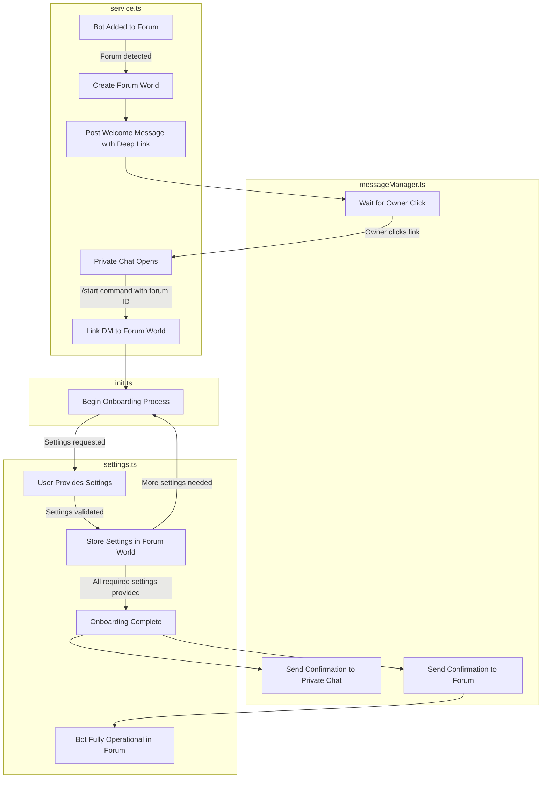

# Telegram Plugin Flow Logic: Data Structure and Entity Management

## Overview

The Telegram plugin provides integration between Telegram's messaging platform and ElizaOS's entity management system. It maps Telegram's distinct chat types (private chats, groups, supergroups, and channels) to ElizaOS's internal representation of worlds, rooms, and entities. This document explains the architecture, data flow, and entity management approach.

## Data Hierarchy and Mapping

### Telegram to ElizaOS Mapping

| Telegram Structure            | ElizaOS Structure | Description                                                           |
| ----------------------------- | ----------------- | --------------------------------------------------------------------- |
| Individual User               | World             | User-specific container (different from Discord's guild/server model) |
| Chat/Group/Supergroup/Channel | Room              | Space for interactions (DM, group, feed)                              |
| User/Member                   | Entity            | Users, bots, and other actors in the system                           |
| Admin/Creator                 | Role (enum)       | Permission hierarchy (OWNER, ADMIN, MEMBER)                           |
| Message                       | Memory            | Stored conversation or interaction                                    |
| Reaction                      | Memory            | Stored reaction to a message                                          |
| Forum Supergroup              | World             | Special case: Maps to a World similar to Discord's guild model        |
| Forum Topic                   | Room              | Special case: Maps to a Room within the Forum Supergroup World        |

### ID Transformation Strategy

Since Telegram uses different ID formats (including integers and sometimes negative numbers) than ElizaOS (which requires UUIDs), proper ID transformation is critical:

1. **Consistent ID Generation**:

   - All IDs must be deterministically generated from the same inputs
   - UUIDs must preserve the original Telegram ID information
   - Collisions must be prevented across different object types

2. **Prefixing Strategy**:

   - Add type-specific prefixes before Telegram IDs to create context
   - Examples:
     - User ID: `user-{telegramId}`
     - Chat ID: `chat-{telegramId}`
     - Group ID: `group-{telegramId}`
     - Topic ID: `topic-{telegramId}-{chatId}`

3. **Handling Negative IDs**:

   - For negative IDs, preserve the negative sign in the generated string
   - Example: `chat--123456789` (for chat ID -123456789)

4. **Special Cases**:
   - Forum topics use a combination of group ID and topic ID
   - Channel/discussion pair relationships use both IDs for proper linking

## Core Initialization Flow

When the Telegram plugin starts:

1. **Client Initialization** (`TelegramService.constructor`)

   - Telegraf client is created with required options
   - Bot token is validated and used to authenticate
   - Message manager is instantiated

2. **Connection Establishment** (`initializeBot`)

   - Launches bot with `dropPendingUpdates` option
   - Gets bot info for identification
   - Sets up signal handlers for graceful shutdown

3. **Message Handler Setup** (`setupMessageHandlers`)
   - Registers handlers for different message types
   - Sets up reaction handling

## World and Room Model

Unlike Discord where a server (guild) maps to a world, in Telegram:

1. **User-Centric World Model**

   - Each user gets their own "World" (`ensureUserWorld`)
   - User ID is used to generate a deterministic world ID
   - World contains all chats the user participates in

2. **Chat-Based Room Model**

   - Each chat (private, group, supergroup, channel) becomes a Room
   - Room types map based on Telegram chat types:
     - `private` → `ChannelType.DM`
     - `group` → `ChannelType.GROUP`
     - `supergroup` → `ChannelType.GROUP`
     - `channel` → `ChannelType.FEED`

3. **Chat ID Management**
   - Rooms use deterministic IDs based on user ID + chat ID
   - This ensures consistent referencing in the system

## World Creation and Management

### World Creation Flow

When a user first interacts with the bot:

1. **Event Triggering** (`setupInteraction`)

   - Telegram message event triggers initialization
   - System checks if the chat is authorized

2. **World Creation** (`ensureUserWorld`)

   - Generate deterministic UUID for the world
   - Associate with the user's Telegram ID
   - Create standardized representation

3. **Room Creation** (`ensureUserRoom`)

   - Determine chat type and appropriate channel type
   - Generate deterministic UUID for the room
   - Store chat metadata (member count for groups)

4. **Entity Creation** (`ensureUserEntity`)

   - Create entity for the message sender
   - Generate deterministic UUID based on user ID
   - Store Telegram-specific metadata

5. **Group Entity Discovery** (`getGroupEntities`)
   - For group chats, fetch administrators
   - Create entities for other members
   - Assign appropriate roles based on admin status

```typescript
// World creation from Telegram user
const worldId = createUniqueUuid(this.runtime, `world-${userId}`) as UUID;
const world = {
  id: worldId,
  name: `${ctx.from.first_name || ctx.from.username || 'Unknown User'}'s World`,
  agentId: this.runtime.agentId,
  serverId: userId,
  metadata: {
    source: 'telegram',
    ownership: { ownerId: entityId },
    roles: {
      [entityId]: Role.OWNER,
    },
  },
};
```

## Entity Management and Rolodex Integration

The Telegram plugin integrates with the Digital Rolodex system similarly to Discord:

### Entity Creation and Resolution

1. **Entity Creation** (`ensureUserEntity`)

   - Telegram users mapped to entities with unique IDs
   - Names collected from first_name, username
   - Metadata includes Telegram-specific information

2. **Entity Resolution**

   - Uses same core entity resolution system as Discord
   - Special handling for Telegram's mention formats
   - Context-aware resolution of references

3. **Component Management**
   - Telegram-specific metadata stored as entity components
   - Components include username, name, and ID
   - Permission filtering based on admin status

### Relationship Management

1. **Relationship Establishment**

   - Initial relationships established during interaction setup
   - Chat administrators identified and tagged
   - Creator/owner relationship tagged appropriately

2. **Relationship Evolution**

   - Same reflection evaluator processes conversations
   - New relationships created based on interaction patterns
   - Existing relationships updated with interaction counts

3. **Relationship Storage**
   - Uses same directional relationship storage as Discord
   - Tags differentiate between private_interaction and group_interaction
   - Metadata includes interaction frequency metrics

## Role Management

Roles in Telegram are mapped to the ElizaOS role system:

1. **Initial Role Assignment**

   - Message sender assigned OWNER role for their world
   - Chat creator/owner assigned ADMIN role
   - Other administrators also assigned ADMIN role
   - Regular members assigned MEMBER role

2. **Role Storage**

   - Roles stored in world metadata
   - Same structure: `{ [entityId]: Role.ENUM_VALUE }`
   - Used by the roles provider for permission checks

3. **Role Provider**
   - Uses same roles provider as Discord
   - Formats role information for agent consumption
   - Groups entities by role for hierarchical understanding

## Message Flow and Memory Creation

1. **Message Reception** (`handleMessage`)

   - Telegram message event captured
   - Message converted to standardized format

2. **Media Processing**

   - Special handling for different Telegram media types
   - Images processed to extract descriptions (`processImage`)
   - Multiple media types supported (photo, video, document, etc.)

3. **Message Chunking**

   - Handles Telegram's 4096 character limit
   - Long messages split into chunks (`splitMessage`)
   - Preserves reply context across chunks

4. **Memory Creation**

   - Message stored as memory with embeddings
   - Connected to relevant entities and rooms

5. **Event Emission**

   - `MESSAGE_RECEIVED` event triggered
   - Same core message handler processes the message

6. **Response Generation**
   - Agent generates response via core logic
   - Response sent back through Telegram client
   - Long responses handled through chunking

## Key Differences from Discord

1. **World Model**

   - Discord: Server/Guild = World
   - Telegram: User = World (user-centric model)

2. **Room Structure**

   - Discord: Channels are organized within a guild
   - Telegram: Chats exist independently, linked by user participation

3. **Group Entities**

   - Discord: All members visible in member list
   - Telegram: Only admins fetched initially, others discovered through interactions

4. **Media Handling**

   - More diverse media types in Telegram
   - Special handling for different media formats

5. **Message Limits**
   - Telegram has 4096 character limit
   - Requires message chunking for long responses

## Database Tables and Relationships

The Telegram plugin works with the same core database tables as Discord:

### Entities Table

```
entities {
  id: UUID (primary key)
  names: string[]
  agentId: UUID (foreign key)
  metadata: {
    telegram: {
      id: string
      username: string
      name: string
      isAdmin?: boolean
      adminTitle?: string
    }
  }
}
```

### Rooms Table

```
rooms {
  id: UUID (primary key)
  name: string
  type: ChannelType (enum)
  worldId: UUID (foreign key)
  source: string ("telegram")
  channelId: string
  serverId: string
  metadata?: {
    memberCount?: number
  }
}
```

### Worlds Table

```
worlds {
  id: UUID (primary key)
  name: string
  agentId: UUID (foreign key)
  serverId: string
  metadata: {
    source: string ("telegram")
    ownership: { ownerId: UUID }
    roles: { [entityId: UUID]: Role }
  }
}
```

### Relationships Table

```
relationships {
  sourceEntityId: UUID (primary key, foreign key)
  targetEntityId: UUID (primary key, foreign key)
  tags: string[]
  metadata: {
    interactions: number
    firstInteraction: number (timestamp)
    lastInteraction: number (timestamp)
  }
}
```

### Memories-Messages Table

```
memories-messages {
  id: UUID (primary key)
  entityId: UUID (foreign key)
  roomId: UUID (foreign key)
  agentId: UUID (foreign key)
  content: {
    text: string
    thought?: string
    actions?: string[]
    inReplyTo?: UUID
    source: string ("telegram")
    channelType: ChannelType
  }
  createdAt: number (timestamp)
}
```

## Handling Telegram-Specific Features

### Topics in Supergroups

While Telegram supergroups can have topics (similar to Discord channels within a server), the current implementation treats each chat as a separate room. A future enhancement could be to:

1. Detect topics within supergroups
2. Create sub-rooms for each topic
3. Link them within the same world structure

### Private Chats (DMs)

Private chats are handled as `ChannelType.DM` rooms and have special considerations:

1. Dedicated world for the user
2. Direct relationship between the bot and the user
3. Enhanced privacy considerations

### Channels and Broadcasts

Telegram channels (one-to-many broadcast communication) are mapped to `ChannelType.FEED` and have:

1. Special handling for admin-only posting rights
2. Support for forwarded messages
3. Anonymous admin posting capabilities

## Conclusion

The Telegram plugin's entity management system provides a comprehensive translation layer between Telegram's chat-based paradigm and ElizaOS's entity graph. By mapping Telegram's unique structure to the common ElizaOS model, it enables agents to:

1. Understand and navigate Telegram's different chat types
2. Track relationships between users across different conversations
3. Maintain context across group and private interactions
4. Process and respond to various media types

While the underlying data model remains consistent with the Digital Rolodex system, the Telegram implementation accommodates the platform's unique user-centric world model rather than Discord's server-centric approach. This demonstrates how the flexible ElizaOS architecture can adapt to different messaging platforms while maintaining a consistent internal representation.

#### ISSUES WE ARE FACING WITH ONBOARDING:

The primary challenge with Telegram onboarding is establishing a clear and consistent flow for forum-centric worlds, which differs significantly from Discord's server-based approach.

**Current Flow Issues:**

1. **Telegram Forum Onboarding Workflow Inconsistency**:
   - Unlike Discord where we can directly DM server owners, Telegram permissions don't allow automatic DM initiation
   - We currently lack a standardized flow for how forum settings get initialized
   - Need to establish when/how the bot first interacts with forum owners
2. **Forum Detection and Owner Identification**:

   - Telegram doesn't provide a straightforward way to identify forum ownership in all cases
   - The connection between forum worlds and user worlds needs to be explicitly established
   - We need to handle cases where multiple admins exist but only one should be the "owner"

3. **Message Management Between Contexts**:
   - Messages sent in the forum vs. direct messages require different handlers
   - Settings configuration must happen in DMs but apply to the forum
   - Need a clear way to track which DM conversations are linked to which forums

**Proposed Solution Flow:**

1. **Forum Detection Phase**:
   - Bot is added to a forum/supergroup with forum features
   - System detects it's a forum and creates a forum-centric world
   - Forum metadata is saved including ownership information
2. **Initial Contact Phase**:
   - Bot posts a welcome message in the forum with a deep link
   - Deep link contains an encoded reference to the forum world
   - Only the forum owner/admin can meaningfully use this link
3. **Private Configuration Phase**:
   - Owner clicks the deep link which opens a private chat with the bot
   - Bot receives the `/start` command with the forum identifier
   - Bot establishes a connection between the private chat and the forum
   - Onboarding/settings actions process in the DM context but apply to the forum
4. **Completion and Activation Phase**:
   - After settings are configured in private, they're applied to the forum
   - Bot sends confirmation message in both private chat and forum
   - Bot becomes fully operational in the forum with configured settings

This structured approach respects Telegram's permission model while ensuring a clear path for forum configuration that users can easily understand.

**Cross-Component Coordination for Telegram Onboarding:**

The proposed forum onboarding flow requires coordination across several components:

1. **Service.ts Responsibilities**:

   - Detect forum supergroups during initial bot setup
   - Create forum-centric world structure with proper metadata
   - Post welcome message with deep link in the forum
   - Handle the `/start` command with forum identifier parameter
   - Parse the forum ID and verify it's valid
   - Link the user's DM context with the forum world

2. **MessageManager.ts Responsibilities**:

   - Provide methods for sending/receiving messages in both forums and DMs
   - Handle different message formats between contexts
   - Implement `startOnboardingDM` to begin the settings process
   - Process messages in the onboarding flow and convert them to memories
   - Maintain proper reply chains for multi-part communication

3. **Init.ts Responsibilities**:

   - Register event handlers for world joining events
   - Initialize onboarding structure when a forum world is created
   - Create the onboarding configuration with appropriate settings
   - Provide a fallback `startTelegramOnboardingDM` method for direct initiation
   - Connect the Telegram events with the core onboarding system

4. **Settings.ts Responsibilities**:
   - Process setting update actions in the context of a Telegram forum
   - Store settings in the forum world's metadata
   - Validate and apply settings that are specific to Telegram
   - Handle completion of the onboarding process with confirmation
   - Apply changes made in DM context to the forum world

The key challenge is maintaining the connection between these components through the entire lifecycle - from forum detection, to deep link creation, to private configuration, to application back to the forum. Each step must be aware of the overall flow context to ensure a seamless user experience.

**Telegram Forum Onboarding Flow Diagram:**



This diagram illustrates the complete flow from bot addition to full operation, with each component's responsibilities clearly demarcated. The transition from forum context to private chat and back again is the key innovation that enables proper configuration while respecting Telegram's permissions model.
